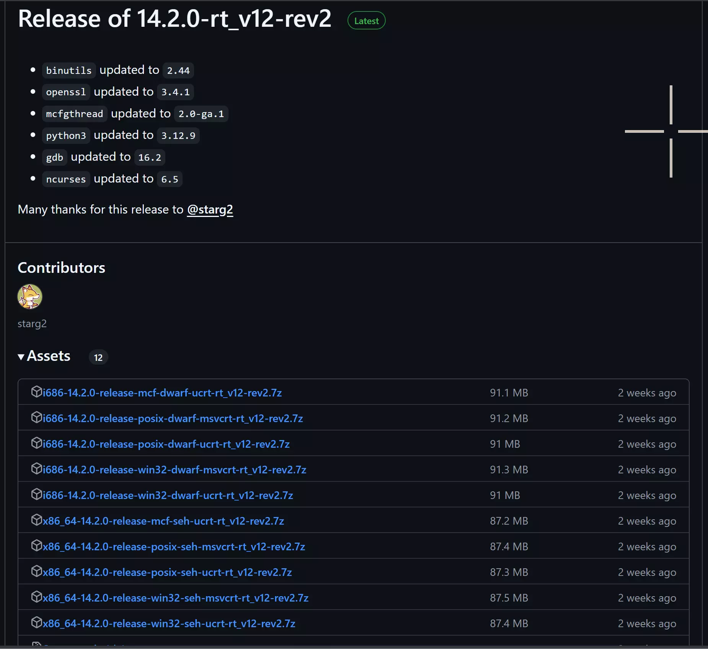
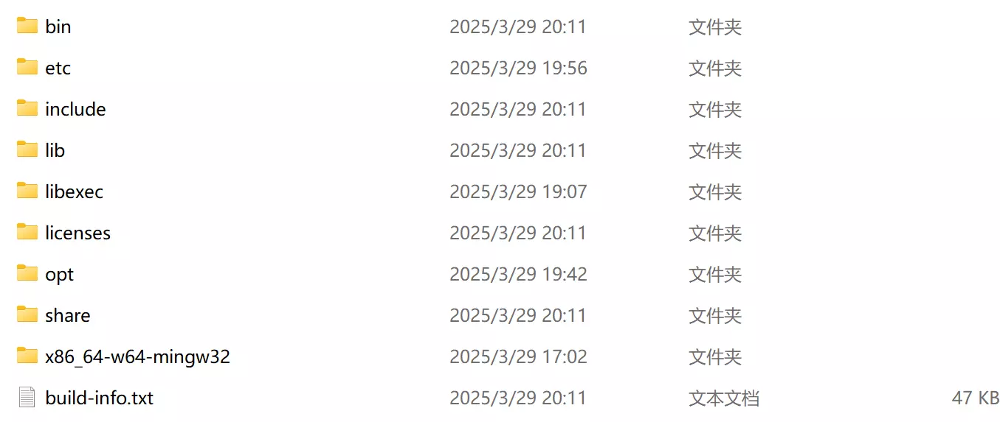
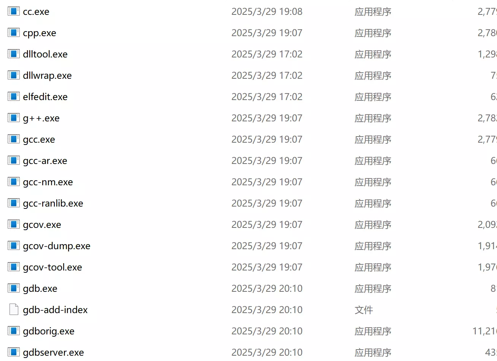
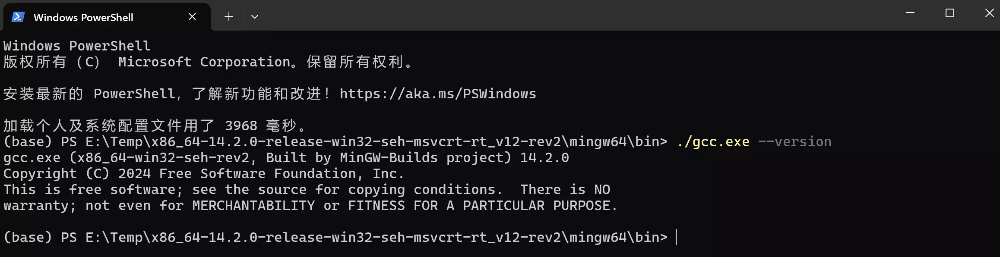

## 前言
在最近，作者的朋友像作者询问如何配置C语言环境，对于环境配置，尤其是Windows下的环境配置，作者之前已经写过一个有关的环境配置教程：
[Scoop环境配置记录](../../Tool/Scoop/Scoop.md)

利用Scoop可以方便的配置C语言的环境，但是作者的朋友表示，只想配置一个C语言的环境，并不想在配置其他的东西。

既然如此，还是写一个有关于如何最快速的完成C语言环境配置的教程。

## 借助工具的配置

这是最简单的方式，只需要下载一个VS或者DevC++,所有环境直接就配完了，还要什么自己配置的麻烦？

因此，这里略去不谈。

## 自主配置
当然上述方式需要进行一个软件的安装，也就是说我们可能需要完成很多并不需要的操作。

在上述前提下，我们可以通过下面几个步骤完成环境的配置：
1. 下载MinGW64
2. 添加环境变量
3. 测试

### 下载MinGW64
正规的版本从Github上下载是最为安全保险的：
[GitHub-MinGW64-Release](https://github.com/niXman/mingw-builds-binaries/releases)

打开后将会出现：


选择自己系统对应的版本即可。

当然Github的官方网站可能不是那么好进入的，作者提前下载了一个版本，为Windows环境下64位版本的：
[MinGW64-14.2.0-作者分享版本](https://openlist.cflmy.cn/sd/iv5f06Iw/Guest/C/x86_64-14.2.0-release-win32-seh-msvcrt-rt_v12-rev2.7z)

### 添加环境变量
在作者还是萌新的时候，其实挺不理解为什么非要添加环境变量的，现在重新回顾这里，作者可以简单的做一个粗浅的解释。

在将下载的MinGW64解压之后，你会看到下列内容：

点击其中的`bin`文件夹并打开，之后你会看到：

其中包含了非常多的可执行文件，接下来在这个文件夹打开一个终端，并输入一下命令：
```ps
./gcc.exe --version
```
你会看到如下的输出：


所以这些可执行文件已经可以完成很多操作了，但是这还不够，因为在当前文件夹下，电脑当然知道你要运行的是什么可执行文件，但是在其他文件位置，这样的操作根本是不行的，因此，我们需要添加环境变量，也就是告诉计算机，当我们想要执行这个可执行文件来编译执行C程序的时候，这个可执行文件在哪里，不然的话，我们就要每次都指定这个可执行文件的位置了。

接下来打开设置，并在搜索栏直接输入`环境`,将会出现：

点击编辑系统环境变量，将会出现：

接下来选择`环境变量`，将会出现：

选中`Path`并点击编辑，在之后进入的窗口点击`新建`:

将你解压的MinGW64文件夹中的`bin`文件夹的路径复制到这里即可。

完成上述操作之后，一路点击`确定`即可。

### 测试
测试的方式非常简单，打开终端，并在终端输入：
```ps
gcc --version
```
只要看到显示输出版本信息，就说明配置成功。

当然，如果你不放心的话，可以在当前目录下，新建一个名为hello_world.c的文件，并在其中输入以下的内容：
```C
#include<stdio.h>

int main()
{
	printf("Hello World!\n");
	return 0;
}
```
保存之后，在终端输入

```ps
gcc hello_world.c -o hello_world
```
-o 后名称的指定了编译生成文件的名称。

接下来只需要在终端输入：
```ps
hello_world
```
如果输出了`Hello World!`，就说明我们的配置是正确的。

## 后记
实话说，作者个人还是非常的推崇Scoop这种迅速配置的工具的，但是并不是所有人都喜欢或者用得上，在这样的前提下，这篇配置指南或许会有所帮助。
