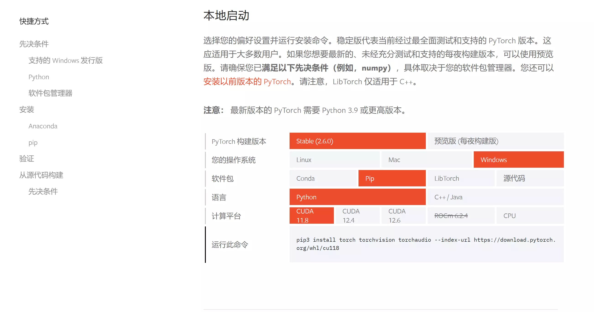

## 前言
由于学习人工智能等的需要，掌握一门不错的深度学习框架还是必需的，故最近尝试学习Pytorch,并写下记录。

## 快速开始
### 本地安装
本地安装Pytorch框架需要进行Python的安装，Python环境的配置可以参考本博客之前的文章——[Scoop环境配置记录](https://blog.cflmy.cn/2024/11/13/Technology/Scoop/Scoop/)和[modelscope自行配置AI的使用](https://blog.cflmy.cn/2025/03/17/Technology/AI/modelscope/)

在安装完Python之后，打开[Pytorch官方本地安装页](https://pytorch.ac.cn/get-started/locally/)
会出现如下界面：

在选择合适的对应版本之后，将命令复制到命令行运行即可完成本地安装。


这里建议使用conda建立一个虚拟环境：
```ps
conda create -n pytorch
```
接着将环境切换到我们新创建的虚拟环境：
```ps
conda activate pytorch
```
接着使用pip安装即可。


### 云安装
在云上使用Pytorch有许多的方式，例如之前提到过的魔搭社区，不过详细要求和本地部署相差不多，因此这里不再赘述。

## 验证安装
在安装之后，需要对是否安装完成进行验证，一种可行的验证方式是在命令行中输入以下的命令：
```ps
python -c "import torch"
```
如果安装成功，则不会报错，否则就是出现了问题，可以尝试排查问题之后，重新尝试。

## 后记
简单来说Pytorch的安装还是相对来说比较简单的，有任何问题非常欢迎评论区讨论。
