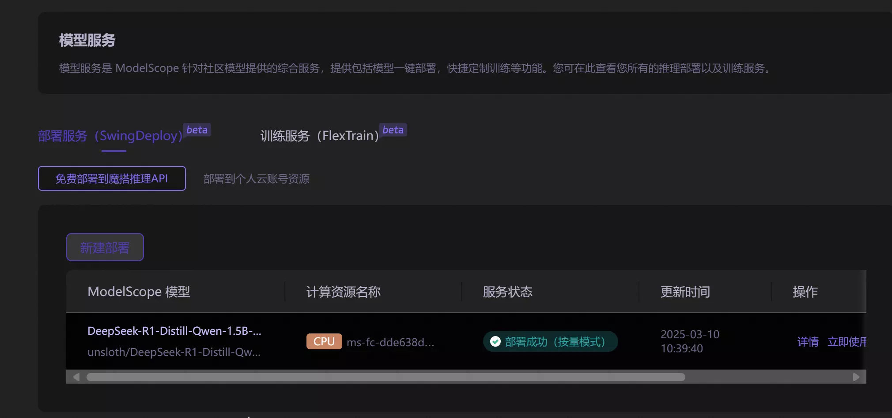
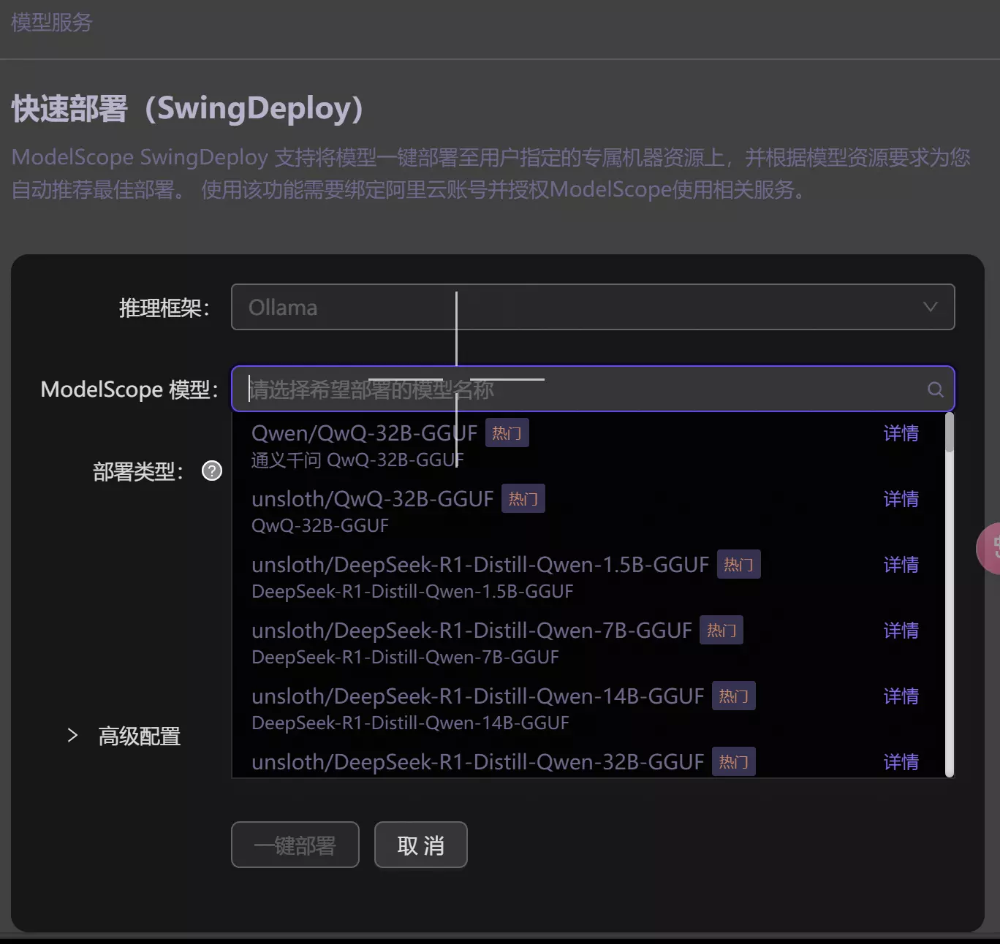
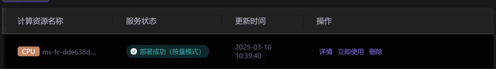
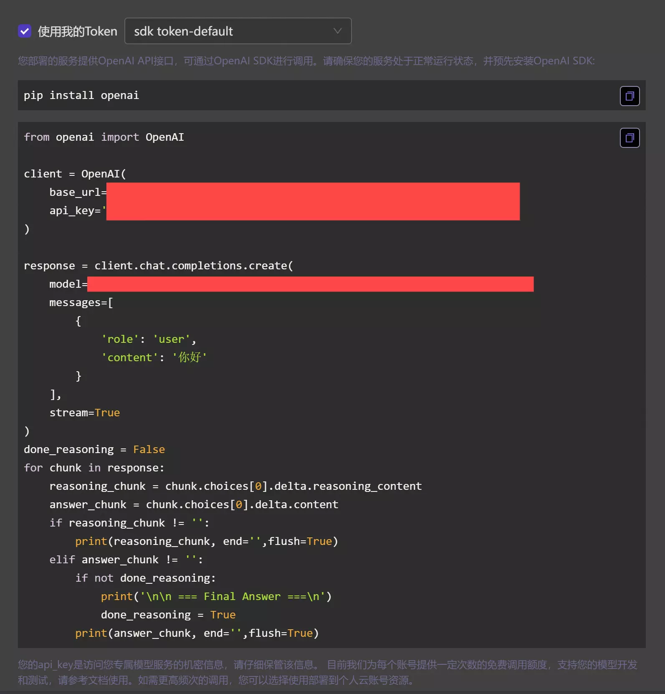

## modelscope
在查阅AI相关的资料的时候，偶然发现了一个非常有意思的网站——[魔搭社区](https://www.modelscope.cn/)
该网站竟然提供免费的CPU算力还有一定时间的免费时长GPU，此外还有免费的配置一个属于自己的模型，并可以通过API来使用。

今天尝试分享一下如何使用自行配置的模型。

## 创建模型
首先需要在魔搭社区注册登录之后，打开首页。

在首页的左侧会出现如下侧边栏：

点击模型服务，会出现如下页面：

> 注：由于作者之前尝试配置过模型，因此已经出现了一个部署后的模型，正常的新建页面只会有新建部署等字样

点击新建部署，并选择想要配置的模型即可：

选择之后，一般需要等待一些时间，一般不会超过五分钟，稍微等待一段时间就好。

## 获取密钥

自己部署好的模型后面会有一个立即使用的字样，点击该字样，会跳转到一个新的页面。

将这里的代码复制下来，稍后会用到。

## 配置调用环境
这里的模型是使用openai的API进行调用的，因此我们需要配置一个调用的环境，具体可以分为如下步骤：

### 配置conda环境（可选）
conda是管理python环境的工具，推荐下载。
安装conda有许多方式，这里延续了之前使用scoop的方式（详情可见[Scoop环境配置记录](https://blog.cflmy.cn/2024/11/13/Technology/Scoop/Scoop/) ）
在命令行输入
```ps
scoop install anaconda3
```
等待安装完成，之后在命令行输入：
```ps
conda init
```
这里是完成conda环境的初始化，conda会创建一个名为base的环境。

### 配置Python虚拟环境（可选）
在安装完conda并初始化之后，会创建一个名为base的环境，但一般情况下，为了保证Python环境的版本和包等管理，会创建一个Python虚拟环境，具体操作如下：
```ps
conda create -n python_env_name python=python_version
#注意这里需要将python_env_name给更换掉
#python=python_version主要是为了指定创建的虚拟环境的版本，是可选的
#例如在本次配置中可以输入如下命令
#conda create -n ms
```
之后，需要将python改变到我们创建的环境中：
```ps
conda activate python_env_name
#注意这里需要保持python_env_name的名称保持一致
#例如在本次配置中，可以输入下列命令
#conda activate ms
```
此时我们就完成了创建一个Python虚拟环境的过程。

### 安装openai
进行到这一步，默认已经配置完成了Python环境，因此打开命令行并输入下列命令
```ps
pip install openai
```
等待下载完成即可。

### 使用API
完成了上述的环境配置之后，我们就可以使用我们配置好的环境了。

下列命令行中的命令是一些推荐的配置方式
```ps
#这些命令是可选的
mkdir ms
#创建一个名为ms的文件夹
touch ms.py
#创建一个名为ms的Python文件
```
之后，我们只需要在文件管理系统中打开创建的ms.py文件，并将之前复制的内容粘贴进去就可以了：
```py
from openai import OpenAI

client = OpenAI(
    base_url='',
    api_key='', # ModelScope Token
)

response = client.chat.completions.create(
    model='', # ModelScope Model-Id
    messages=[
        {
            'role': 'user',
            'content': '你好'#注意如果你想更换问题，请在这里修改
        }
    ],
    stream=True
)
done_reasoning = False
for chunk in response:
    reasoning_chunk = chunk.choices[0].delta.reasoning_content
    answer_chunk = chunk.choices[0].delta.content
    if reasoning_chunk != '':
        print(reasoning_chunk, end='',flush=True)
    elif answer_chunk != '':
        if not done_reasoning:
            print('\n\n === Final Answer ===\n')
            done_reasoning = True
        print(answer_chunk, end='',flush=True)
```
保存之后，回到刚刚的命令行并执行：
```ps
#这里是可选的，你可以使用其他的执行方式
python ms.py
```
在执行了上述步骤之后，等待一段时间，你就可以成功的得到一个来自你配置的模型的问候了。

作者在配置之后得到的结果如下：


## 后记
魔搭社区的免费模型服务对于初用AI进行提高来说还是非常有用的，这里的模型部署服务的API调用在每日前两千次都是免费的，除了速度慢一点，基本没有什么太大的缺点。
此外，魔搭社区还有免费的算力服务，可以继续深入探索。