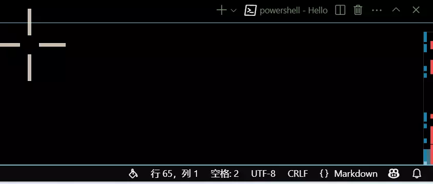
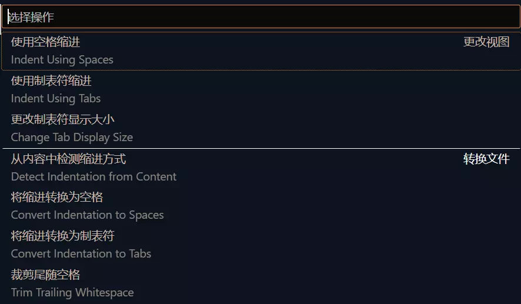

## 前言
在学习过程中，编写的代码体量一般都不是很大，但是总有些时候，需要进行大规模的代码编写，这种时候，编译这些大体量的代码就变成了一个不是那么简单的事情，所幸还是有很多的工具能够帮助我们完成，make就是其中之一，作者正在自学make的一些知识，这里做一个简单的记录。

[GNU make 官方文档](https://www.gnu.org/software/make/manual/make.html)

## 下载
在linux下进行make的下载还是比较简单的，在命令行使用包管理工具下载即可：
```ps
sudo apt install make
#或者可以直接安装开发工具组：
#sudo apt install build-essential
```
```ps
sudo yum install make
#或者可以直接安装开发工具组：
#sudo yum groupinstall "Development Tools"
```
```ps
sudo dnf install make
#或者可以直接安装开发工具组：
#sudo dnf groupinstall "Development Tools"
```

在windows下安装也是比较简单的可以直接使用scoop包管理工具进行下载：
```ps
scoop install make
```
其中scoop配置教程见本博客：
[Scoop环境配置记录](../Scoop/Scoop.md)

或者可以直接通过安装MinGW64完成，具体的步骤见（这里的步骤保持不变即可）：
[C语言环境配置（最直接）](../Scoop/Scoop.md)

安装完成后，输入：
```ps
make --version
```
观察到正确输出版本号即可。

## 编写Makefile
使用make需要编写Makefile，详细的语法在官方文档中已经完全写出，可以进行查阅，下面列出一些简单的语法：

1. 基本规则
```Makefile
OutPutFileName:InPutFileName
	Command To Make InPutFile Become OutPutFile
```
例如，想要编译一个C语言文件，假如名称为`Hello.c`，一般使用的命令为：
```ps
gcc Hello.c -o Hello
```
这条命令中，`InPutFile`就是`Hello.c`而`OutPutFile`就是`Hello`因此Makefile就可以这么写：
```Makefile
Hello:Hello.c
	gcc Hello.c -o Hello
```

这里需要注意的是，Makefiel会强制要求第二行的Command由Tab制表符缩进完成，而四个空格的缩进会报错，导致无法正常的执行。
因此一定要进行调整。


Vscode下可以通过底边栏将该文件的缩进字符改为Tab缩进。
首先找到如下位置：

点击空格，会弹出：

选择使用制表符缩进，会切换到：

点击长度之后会自动切换到使用制表符缩进，此时就不会再报错了。


2. 删除某些文件
```Makefile
.PHONY:clean
clean:
	rm -f FileName
```
有些时候，编译会产生一些中间的文件，这个时候，需要清除掉，例如：
下面的Makefile文件：
```Makefile
#C语言编译
#注：由于make在编译的时候，目标文件是第一个，因此下面的Makefile文件的内容看上去就好像和正常的编译顺序不同
# 链接
Hello: Hello.o
	gcc Hello.o -o Hello

# 汇编
Hello.o: Hello.s
	gcc -c Hello.s -o Hello.o

# 编译
Hello.s: Hello.i
	gcc -S Hello.i -o Hello.s

# 预处理
Hello.i: Hello.c
	gcc -E Hello.c -o Hello.i
```
将会产生中间文件，有些时候需要清除这些中间文件：
```Makefile
.PHONY:clean
clean:
	rm -f Hello.i Hello.s Hello.o
```


上述clean命令在Linux下是有用的，但是在Windows下执行就可能会失败，在Windows下的删除命令可能可以这么写：
```ps
rm -Force Hello.i,Hello.s,Hello.o
#-f参数在Windows下会有两个匹配，因此会报错，此外不同文件之间的连接也需要使用逗号
```
或者：
```ps
del /f Hello.i Hello.s Hello.o Hello
```
又或者：
```ps
Remove-Item -Force Hello.i, Hello.s, Hello.o, Hello
```

但是作者在尝试了非常多次之后，发现上述命令总会报错，在几经尝试之后，只有按照下面的方式得到的结果才是正确的：
```ps
powershell -Command "Remove-Item -Path @('Hello.i', 'Hello.o', 'Hello.s') -Force -ErrorAction SilentlyContinue"
```

对于这一问题，Windows下的读者在使用的过程中可以继续探索，作者很期待收到反馈。


知道了上述的两种方式，编写一个Makefile已经是非常简单了。

## 使用make
在创建一个名为`Makefile`的文件在当前文件夹之后，就可以直接打开命令行到当前的文件夹下输入：
```ps
make
```
之后文件就会自动编译生成，如果想要清理中间文件，也就是调用我们之前编写的`clean`命令，则只需要输入：
```ps
make clean
```

## 后记
以上就是make的简单使用方式了，掌握之后基本就可以正常的使用make了。

此外make还有许多的进阶使用方式，会在日后 进行更新的。