## 前言
PlantUml是一种可以快速画出图像的语言。由于其使用脚本语言进行图像的生成，使得该语言非常便于维护。

## 安装方式
### 在线版（免安装调试）
点击左边链接即可免费在线使用：[PlantUml Web Server](https://www.plantuml.com/plantuml/)
### 本地版
可以使用本博客前文配置的Scoop：[Scoop环境配置记录](https://blog.cflmy.cn/2024/11/13/Technology/Scoop/)进行相关配置，比较方便快捷，其他配置方式不在赘述，有兴趣的朋友可以自行进行配置。

## 使用方式
### Hello World!
尽管一个画图软件使用Hello World!看起来非常的奇怪而且怪异，但是为了某种统一的形式，这里还是将Hello World!作为介绍的起始。
~~~
@startuml
start
:Hello World!;
stop
@enduml
~~~
这里使用的是PlantUml的活动图新语法，显示出来的效果如下所示：
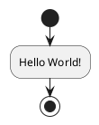

### Comment
就像写程序一样，我们也可以在PlantUml中插入注释。
在PlantUml中写注释的文本需要使用[克里奥尔维基语法](https://plantuml.com/zh/creole)。这里不具体列出该语法的具体内容，仅介绍如何在活动图中插入注释，注释可以进行形式等的修改，但是出于注释的本意是为了增加代码的可读性的考虑，在图表中的注释是否需要如此复杂，暂时还在考虑中，暂时不在此篇过多赘述。
~~~
@startuml
start
:Print Hello World!;
note
  Output hello world!
end note
stop
@enduml
~~~
显示效果
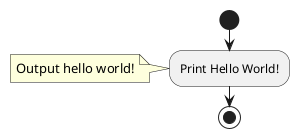

### 顺序语句
顺序语句几乎在任何一种语言都要使用的部分，但是相对比较容易理解，因此本博客将其作为活动图的基本语法来进行讲解。
#### 活动图的创建
下面语言标记了接下来我们要创建一个活动图表：
~~~
@startuml
@enduml
~~~
#### 开始、结束标志
* start开始、stop结束
~~~
@startuml
start
stop
@enduml
~~~
* start开始、end结束
~~~
@startuml
start
end
@enduml
~~~
#### 正常语句行为
每个这样的语句都需要用冒号':'开始，以分号';'结束。需要注意的是这些符号必须要是半角符号（即在英文输入法下输入的符号）
~~~
@startuml
:A common sentence;
@enduml
~~~
#### 示例
将上述几个部分组装到一起就可以展现出如下形式：
~~~
@startuml
start
:start;
  note 
    需要注意不加冒号和分号的start的区分
  end note
:;
  note right
    空语句
  end note
:A common sentence;
:stop;
stop
@enduml
~~~
展现出来的效果如下：
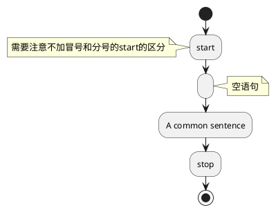
### 分支语句
#### if语句（两个分支）
##### if (...) then (...)语法
~~~
@startuml
start
if (condition?) then (True)
  :True Branch;
else (False)
  :False Branch;
endif
stop
@enduml
~~~
展示的效果如下所示：
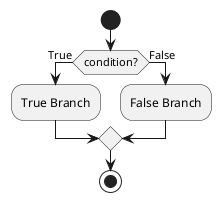
##### if (...) is (...) then
~~~
@startuml
start
if (condition?) is (True) then
  :True Branch;
else
  :False Branch;
endif
stop
@enduml
~~~
展示的效果如下所示：
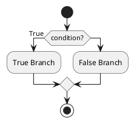
##### if (...) equals (...) then
~~~
@startuml
start
if (condition value) equals (True) then
  :True Branch;
else
  :False Branch;
endif
stop
@enduml
~~~
展示的效果如下所示：
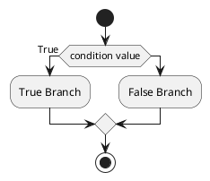
#### if语句（多个分支）
##### 水平
~~~
@startuml
start
if (condition1) then (True)
  :Branch1;
(False) elseif (condition2) then (True)
  :Branch2;
(False) elseif (condition3) then (True)
  :Branch3;
(Flase) elseif (condition that need stop) then (True)
  stop
else (Flase)
  :Last Branch;
endif
:Merge Branch;
stop
@enduml
~~~
显示效果如下所示：
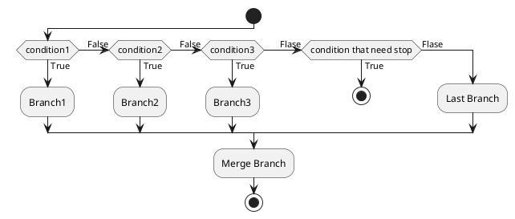
##### 垂直
多个测试默认显示为水平排布，如果想要改变为垂直模式，则需要显示的指定，使用`!pragma useVerticalIf on`来改变即可。
~~~
@startuml
start
!pragma useVerticalIf on
if (condition1) then (True)
  :Branch1;
(False) elseif (condition2) then (True)
  :Branch2;
(False) elseif (condition3) then (True)
  :Branch3;
(Flase) elseif (condition that need stop) then (True)
  stop
else (Flase)
  :Last Branch;
endif
:Merge Branch;
stop
@enduml
~~~
显示效果如下所示：
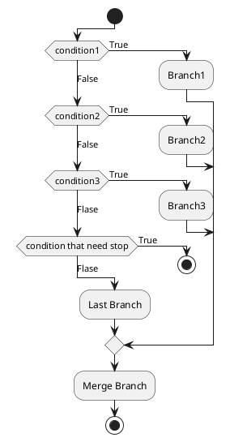
#### switch语句
~~~
@startuml
start
switch (condition)
case (condition1)
  :Branch1;
case (condition2)
  :Branch2;
case (condition3)
  :Branch3;
endswitch
stop
@enduml
~~~
显示效果如下所示：
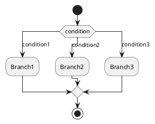
### 循环语句
#### while循环
##### 一般形式
~~~
@startuml
start
while (condition) 
  :WhileBranch;
endwhile
stop
@enduml
~~~
显示的效果如下：
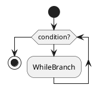
##### 增加更多的循环信息
~~~
@startuml
start
while (condition value) is (True)
  :WhileBranch;
endwhile (false)
end
@enduml
~~~
展示效果如下所示：
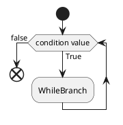
#### repeatwhile类循环
事实上，我个人对于这种写法不是很感冒，并且还是相当困惑与为什么PlantUML不将for循环加入。但是出于对官方技术文档的支持，这里仍然保留了repeatwhile的相关细节
##### 基本结构
~~~
@startuml
start
repeat
  :WhileBranch;
repeat while (condition?)
end
@enduml
~~~
展示的效果如下所示：
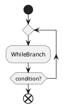
##### 其他结构
~~~
@startuml
start
repeat :BeginPlace;
  :WhileBranch;
backward :BackwardBranch;
repeat while (condition?)
stop
@enduml
~~~
展示效果如下所示：
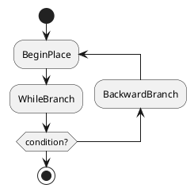

## 后记
到此为止，一个程序基本需要使用的三种语句已经完成了，当然PlantUml还有其他的更高级好用的语句，以及使用方式，后续会继续更新的。

---
### 同系列
[PlantUml-活动图基础](https://blog.cflmy.cn/2024/11/15/Technology/PlantUml/PlantUml-%E6%B4%BB%E5%8A%A8%E5%9B%BE-%E5%9F%BA%E7%A1%80/)
[PlantUml-思维导图基础](https://blog.cflmy.cn/2024/11/18/Technology/PlantUml/PlantUml-%E6%80%9D%E7%BB%B4%E5%AF%BC%E5%9B%BE%E5%9F%BA%E7%A1%80/)