## 简介
### 前言
为什么要写下这样一篇记录？主要是因为在我的第一本电脑悲哀的送修之后，不得不重新配置一台新的电脑，并在旧电脑修理之后需要重新配置环境导致的，但很幸运的是，短时间内配置两台电脑的经历使我对于配置环境有了许多经验以及记录，因此我决定写下此篇，并在之后尝试不断增加相关内容，我希望能在之后给看到的人一点实用的帮助。
### Windows环境配置的最大感受
不得不承认，在Windows下配置环境在熟悉了之后会相当迅速，网络上也有许多的相关教程，但是作为计算机小白刚刚入门时又确实会走许多弯路，在这种情况下，主要原因可能在于需要修改一个path路径在很多时候会令人困惑等。与之相反的许多linux系统能够直接使用apt,yum等包管理工具完成系统环境的配置，就显得Windows系统下的环境配置无比繁琐，因此这里对其尝试做一个系统性的整合，以方便自己的使用。
### 为什么是Scoop?
就像我刚刚说的，配置Linux环境非常简单舒服，很大一部分原因你可以简单的说是因为包管理工具，这里我们简单的这样理解就好，那么在Windows下有没有呢，曾经我认为是没有的，但是显然我是一个见识浅薄的人，Scoop就可以被认为是这样的一个工具，使用它让一切变得无比便捷！
## 安装
### 前言
想要使用Scoop首先需要在Windows下下载并安装它，Windows没有自带一个这样的工具，显然如果自带了，我们平时安装环境可能会舒服很多。

在正式开始之前，你首先要知道如何打开Power Shell，如果你已经掌握了，请跳过。
#### 打开Power Shell
打开Windows文件资源管理器，单击右键，选择在终端打开即可。
### 安装Scoop
Scoop 由澳洲程序员Luke Sampson于2015年创建，其特色之一就是其安装管理不依赖“管理员权限”，这对使用有权限限制的公共计算机的使用者来说相当不错。Scoop的安装步骤如下：
~~~ps
Set-ExecutionPolicy RemoteSigned -scope CurrentUser #打开远程权限
irm get.scoop.sh -outfile 'install.ps1'
.\install.ps1 -ScoopDir 'Scoop_Path' -ScoopGlobalDir 'GlobalScoop_Path' -Proxy 'http://<ip:port>'
# 如
# .\install.ps1 -ScoopDir 'C:\Scoop' -ScoopGlobalDir 'C:\Program Files' -NoProxy
~~~
执行上述命令得到的结果如下：
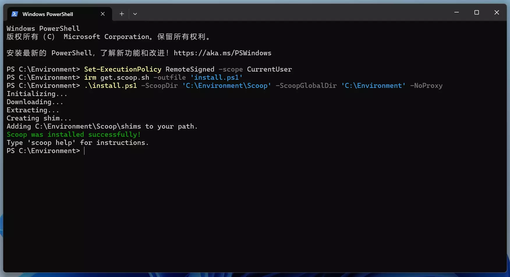

>
小提示：事实上仔细观察上述截图你会发现安装时并非在根目录下完成的，我个人也建议你修改当前的目录，比如像我一样，新建一个Environment的文件夹。


2025年5月20日增补
在友人的提醒下发现
```
irm get.scoop.sh -outfile 'install.ps1'
```
在国内可能由于无法连接导致下载失败，这时可以使用镜像网站来解决，替换命令为：
```
irm scoop.201704.xyz -outfile 'install.ps1'
```
其实这里本质和后文的采用gitee的国内镜像是等价的，读者可以自行选择。

### 更新Scoop
更新Scoop是一件非常简单的事情，但是你可能会遇到许多的问题。最基本的更新命令非常简单：
~~~ps
scoop update
~~~
正常情况下，会自动更新，但是有时也会出现：
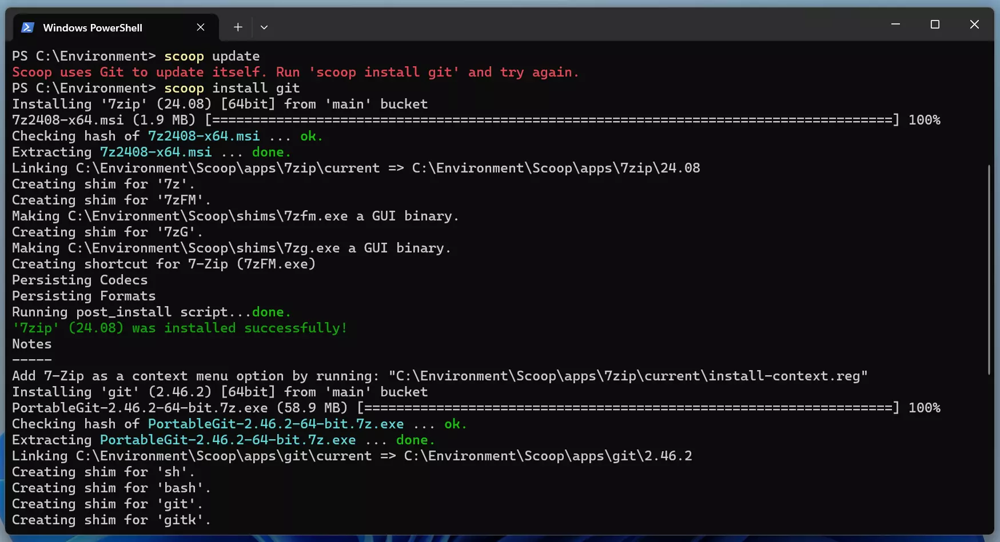
出现上述报错的原因是Scoop需要借助git管理系统来进行更新，在这样的情况下，很简单只需要按照提示输入：
~~~ps
scoop install git 
~~~
Scoop就会自动安装git。
接下来执行`scoop update`即可。
但是事情有时不会像我们想的那么简单，比如说如果你和我一样将会遇到：

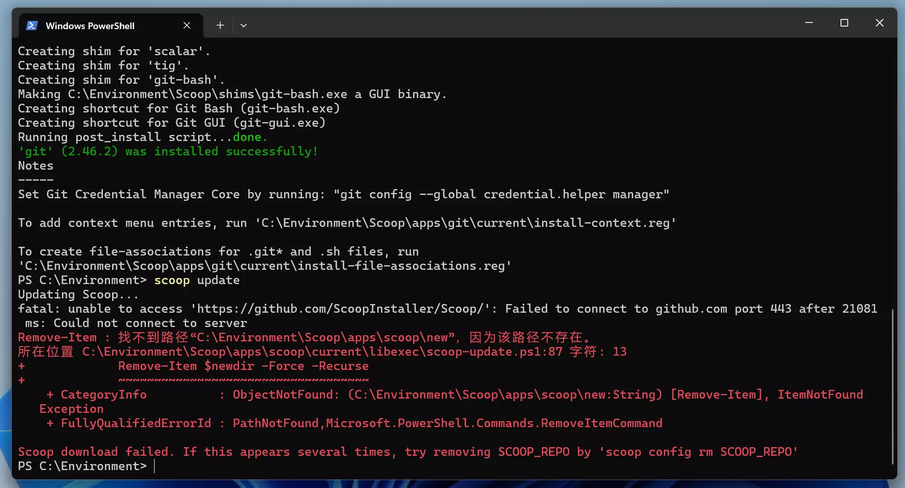
出现这样的报错时，大多数情况下是因为你的网速不够高，或者无法正常的连接到github，很多时候你可以重试几次来完成，但是如果你不想这么做，可以尝试连接国内的镜像源，执行如下命令即可：
~~~ps
scoop config SCOOP_REPO 'https://gitee.com/glsnames/scoop-installer'
scoop update
~~~
但上述命令依然可能失败，而且国内的镜像源有时并不是那么靠谱，或者更新没有那么快，在这样的情况下，为了应对你糟糕的网速，可以尝试使用加速器，需要注意的是github本身在国内是允许访问的，因此在这里使用加速访问github的页面理论上说并不违反法律规定。但总而言之，配置环境有时确实不是那么的简单，如果遭遇了许多挫折，请不要灰心，多尝试几次，最终会得到不错的结果。以下就是我在切换国内的镜像源依然失败之后，多次尝试终于成功的结果：
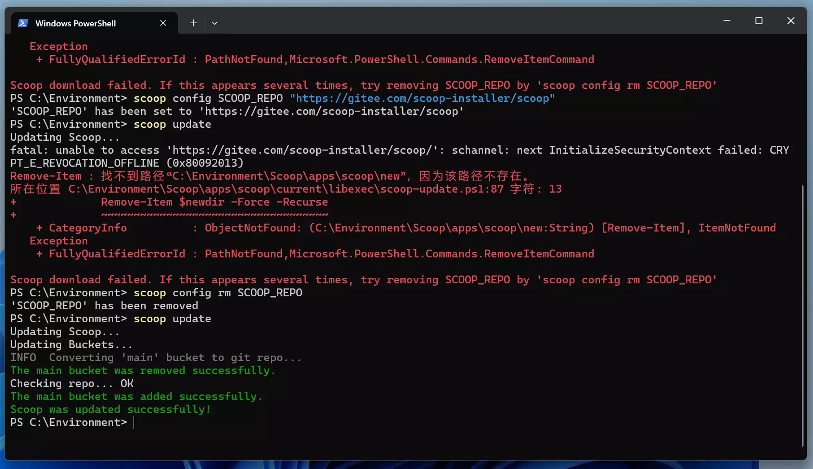
## Scoop使用
### bucket
#### 查询bucket
使用Scoop是一件非常简单的事情，bucket你可以简单的理解为你需要下载的软件的来源，有时候，不同的软件会来自于不同的地方，因此你可以使用如下命令来查询所有的bucket:
~~~ps
scoop bucket known
~~~
你可能会得到如下结果：
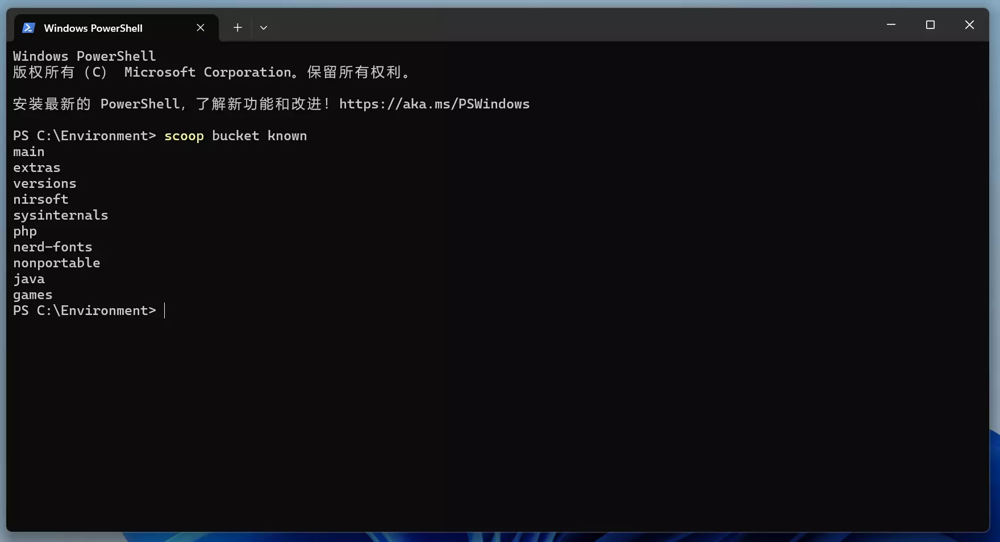

#### 添加bucket
一般而言`main`是自动拥有的，如果需要添加bucket，可以执行如下命令：
~~~ps
scoop bucket add <bucket name>
~~~
同样的Scoop在我眼里之所以强大是因为它可以用来添加第三方库，这一功能使得它本身拥有了非常高的可能性，你可以通过执行如下命令实现：
~~~ps
scoop bucket add <别名(bucket name)><git地址>
#这非常有用，以至于你可以添加一个来尝试：
#scoop bucket add scoopcn https://github.com/scoopcn/scoopcn
~~~
scoopcn是一个主要提供国内中文软件的bucket，使用它你可以下载很多软件，包括QQ和微信。如果不是搜索相关资料，我之前也并不知道Scoop可以做到这样的事情，确实也被震惊到了。
#### 删除bucket
只需要执行如下命令即可：
~~~ps
scoop bucket rm <bucket name>
~~~
### Scoop使用
#### Scoop安装
最基本的用法是：
~~~ps
scoop install <库名/软件名>
~~~
在大多数情况下库名是可以省略的，例如在scoop安装aria2(一个用于加速Scoop下载的程序，推荐下载)和gcc(c语言环境)：
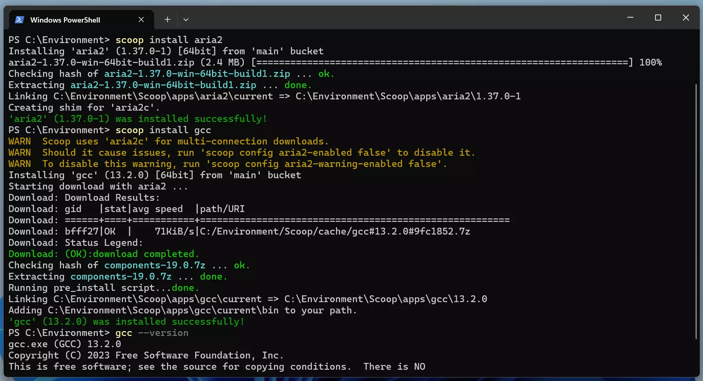
#### Scoop删除
~~~ps
scoop uninstall <软件名>
~~~
#### Scoop更新
~~~ps
scoop update * 
#*表示是可选的意思，如果不写就是scoop自己的更新。
~~~
#### Scoop环境版本控制
这是一个非常有用的东西，因为很多时候不同的环境有不同的版本，有些版本可能会出现不兼容的情况，在我看来，能够进行版本控制是Scoop非常好用的一点。版本控制的命令如下：
~~~ps
scoop reset <软件名@版本号>
~~~

## 实战
在熟悉了上述操作之后，你就可以开始一些不错的尝试了，这里给出了一些有趣的环境配置过程，其中或许会出现一些不那么常用的命令，仅供参考。
### 下载sudo
这是一个在我看来非常奇怪的东西，直接执行命令：
~~~ps
scoop install sudo
~~~
之所以说它奇怪，是因为你或许能够发现，当你可以在Windows中下载这东西的时候，似乎可以继续添加让它变成一个类Linux的系统了，但是我选择了停止进一步的探索，下载sudo单纯是因为scoop下载某些软件需要管理员权限，只需要在命令前添加sudo即可。
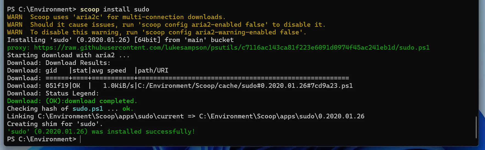
### 添加easy-win
就像我之前提到的，很多时候使用Scoop由于网速问题会出现很多问题，因此可以尝试使用easy-win来进行规避。
~~~ps
scoop bucket add easy-win https://gitee.com/easy-win/scoop-mirror
~~~
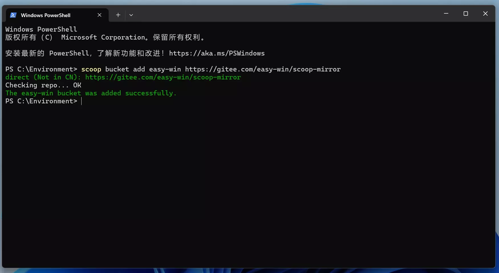
### 安装Latex
安装latex其实有很多种方式，可以选择直接下载一个十几G的texlive，我曾经尝试这么做，但是太过占据磁盘空间，Scoop提供了一个不错的安装latex的方式。
~~~ps
# 使用 TeXLive
scoop bucket add scoopet https://github.com/ivaquero/scoopet
#这里可能会失败，可以使用国内镜像https://gitee.com/scoop-installer/scoopet
scoop install texlive
# 使用 MikTeX
scoop install latex
#如果安装失败可以使用scoop install easy-win/latex。上文添加的easy-win就是做这个的
~~~
使用国内的镜像在很多时候可以规避大多数问题（尽管有时也不是那么好用，总之如果你可以直接下载完成就没必要更换，但是如果不行，那就尝试一下国内镜像，或许会有惊喜。），这里有一个记录了国内大多数镜像的链接：[Gitee的Scoop国内镜像](https://gitee.com/scoop-installer#:~:text=scoop%E5%9B%BD%E5%86%85%E9%95%9C%E5%83%8F%E4%BC%98)
            
添加Scoopet:
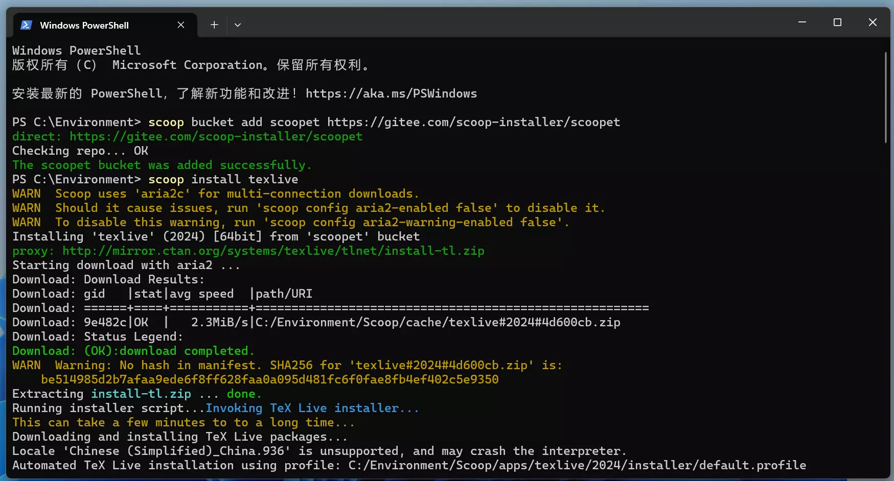

texlive下载完成：
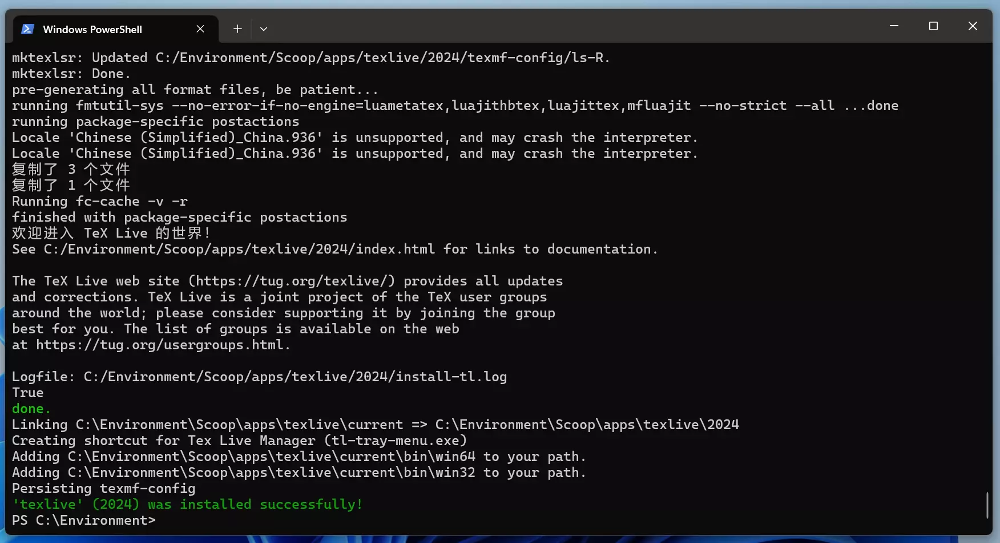

下载MikTex:
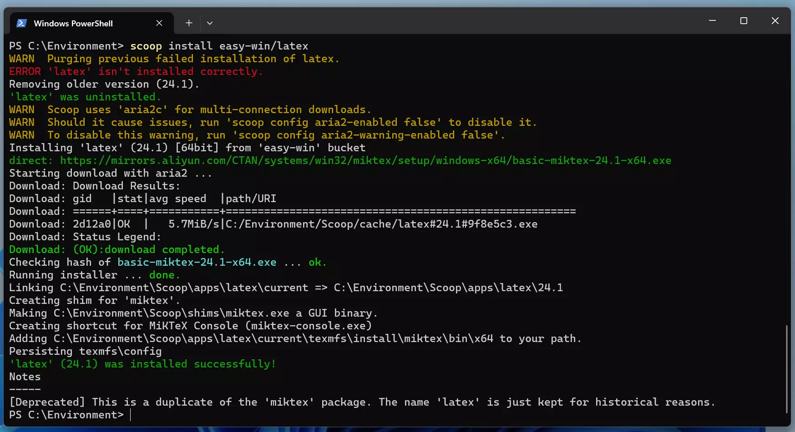

### 安装Java环境
在该部分，将会出现一个很有意思的东西，如何使用Scoop进行版本控制。
要下载Java环境按照以下步骤即可：
~~~ps
scoop bucket add java
#可以切换至国内镜像源
scoop install oraclejdk
#scoop install openjdk10
~~~
安装过程：
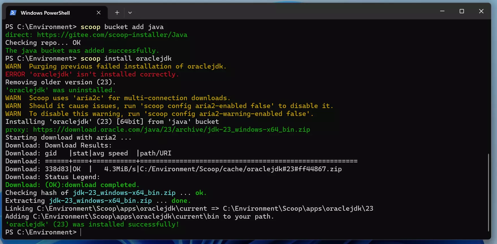
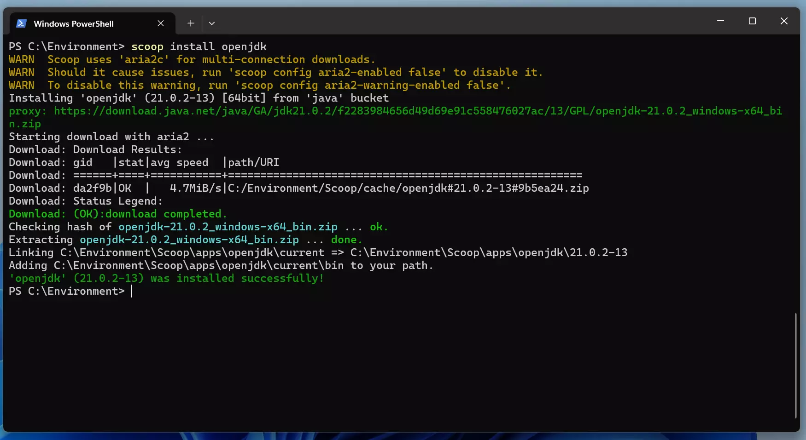

但是，之所以要特别提出java是因为一个Scoop在我看来非常有用的功能，切换不同版本的环境，该命令如下：
~~~ps
scoop reset <软件名@版本号>
~~~
可以用于切换不同的环境：
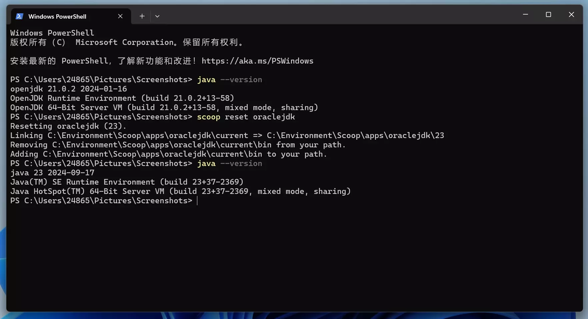
### 安装puml
之所以将这个软件单独提出来是因为这是一个非常好的代码制图软件，尤其是在大二数据结构课程中，某些老师的某些作业可能会用到。同时在这里会有一个Scoop的新命令出现，这个命令适用于搜索你不知道是否存在的软件：
~~~ps
scoop search <软件名>
~~~
搜索plantuml并下载：
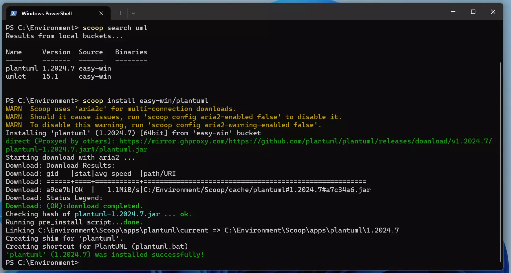
### 其他
如果需要C语言环境，已经在前文中下载gcc时完成了。其他需要配置的环境基本就是上面的流程，因此基本不再赘述。后续或许会有补充以及更新。
