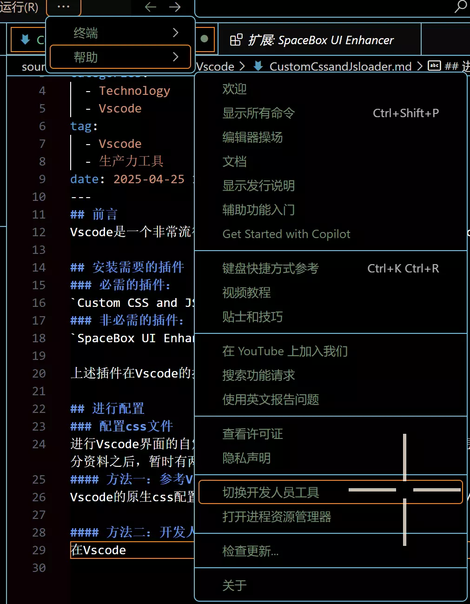
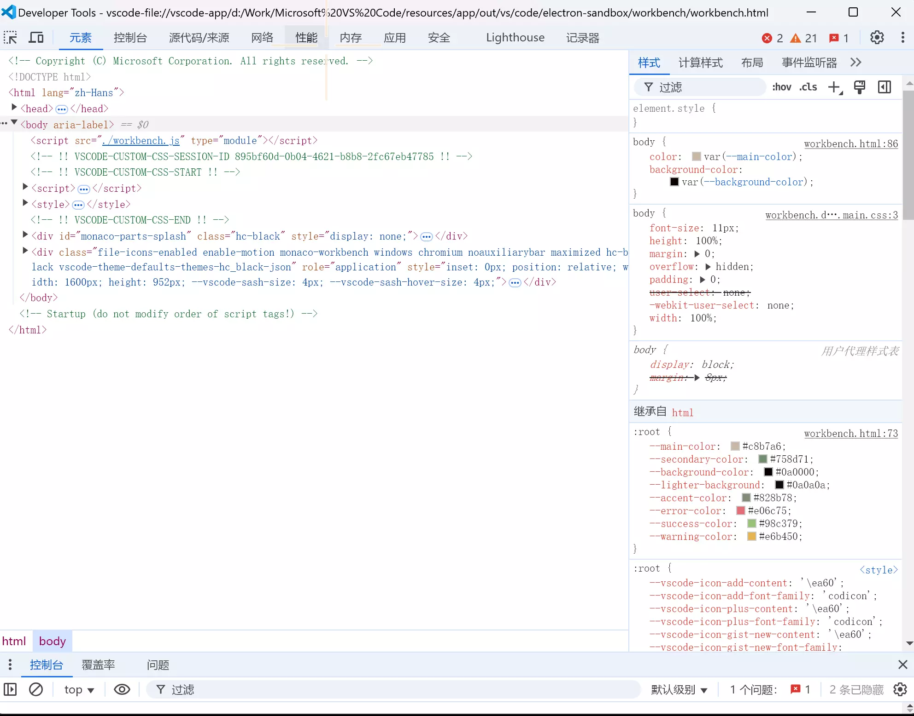
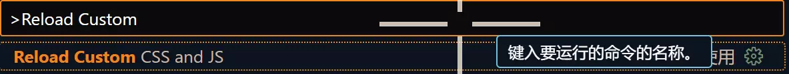

## 前言
Vscode是一个非常流行的开源编辑器，拥有一个看起来与众不同的Vscode编辑器对作者本人而言还是非常有吸引力的，这里分享一下作者的配置。

## 安装需要的插件
### 必需的插件：
`Custom CSS and JS Loader`
### 非必需的插件：
`SpaceBox UI Enhancer` 实现界面的动效

上述插件在Vscode的拓展部分下载之后即可使用。

## 进行配置
### 配置css文件
进行Vscode界面的自定义过程离不开css文件，这个文件指定了我们想要的样式，那么如何进行这个文件的书写呢，Custom CSS and JS Loader并没有给出答案，在查阅了部分资料之后，暂时有两种方式来完成这个部分：
#### 方法一：参考Vscode的css文件
Vscode的原生css配置文件存在与`VscodeInstallPath/resources/app/out/vs/workbench/workbench.desktop.main.css`下，可以参考本文件进行自定义的格式书写。

#### 方法二：开发人员工具
在Vscode下可以打开开发人员工具，即顶边栏找到`帮助`再打开`切换开发人员工具`即可，如下列截图所示：

此时会打开界面：


和浏览器的开发人员工具十分类似，可以通过这个工具查看元素，并进行自定义。

#### 作者分享的配置
以下是作者自己写的一个配置文件作为参考：
```css
/*
	用到的设计元素：
		莫兰迪色系：
      白色类：
        莫兰蒂米白色：#c8b7a6
			浅绿色类：
				霜封苔原：rgb(233,237,214)
        初春夏田：rgb(173,194,185)
        莫兰迪绿：#758d71
        莫兰蒂灰绿：#828b78
        莫兰迪亮绿：#b5c4b1
			黑色类：
				洗砚池：rgb(76,79,74)
        莫兰迪黑：#0a0000
			灰色类：
				泥炭：rgb(133,133,140)
				卡普里微风：rgb(187,184,185)
        青城灰：rgb(179,179,163)
      灰蓝色类：
        莫兰迪灰蓝：#858fac
        莫兰迪灰紫：#544e70
*/

/* 目前还在学习中，暂时先尝试更改一些简单的内容 */
/*主体背景部分，暂定使用比较黑的颜色*/

/* Custom VS Code Theme using Custom CSS and JS Loader */

:root {
	/* 主色调 */
	--main-color: #c8b7a6;        /* 偏米色的主文字颜色 */
	--secondary-color: #758d71;   /* 偏绿色的辅助文字颜色 */
	--background-color: #0a0000;  /* 深色背景 */
	--lighter-background: #0a0a0a; /* 略浅的背景 */
	--accent-color: #828b78;      /* 一个强调色 */
	--error-color: #e06c75;       /* 错误提示颜色 */
	--success-color: #98c379;     /* 成功提示颜色 */
	--warning-color: #e6b450;     /* 警告提示颜色 */
  }
  
  /* 全局设置 */
  body {
	color: var(--main-color);
	background-color: var(--background-color);
  }
  
  /* 编辑器区域 */
  .monaco-editor .margin,
  .monaco-editor .content {
	background-color: var(--background-color) !important; /* 编辑器背景 */
  }
  
  .monaco-editor .line-numbers {
	color: #5c6370 !important;  /*行号*/
  }
  
  .monaco-editor .cursor {
	border-color: var(--main-color) !important; /* 光标颜色 */
  }
  
  .monaco-editor .selection {
	background-color: rgba(97, 175, 239, 0.2) !important; /* 选中文字背景 */
  }

  .monaco-editor-background{
    background-color: var(--vscode-editor-background) !important;
  }
  
  /* 代码高亮（根据需要调整）*/
  .monaco-editor .mtk6 { /*  字符串 */
	color: #98c379 !important; /* 继承 --success-color */
  }
  
  .monaco-editor .mtk7 { /*  数字 */
	color: #d19a66 !important; /* 橙色或棕色，更柔和 */
  }
  
  .monaco-editor .mtk13 {  /*注释*/
	  color: #6B8E23 !important; /*更加柔和的绿色*/
	  font-style: italic;
  }
  /*
  .monaco-editor .mtk1 {  /*关键字,如 let, const, function*/
	  /*color: #c678dd !important;
  }
  */
  .monaco-editor .mtk2{ /* 类名 */
	color: var(--accent-color) !important;
  }
  
  
  /* UI 元素 (侧边栏，状态栏，标题栏) - 调整颜色以匹配主题 */
  
  /* 侧边栏 */
  .sidebar {
	background-color: var(--lighter-background); /* 侧边栏背景 */
	color: var(--main-color);
  }
  
  .sidebar .title {
	color: var(--secondary-color);
  }
  
  /* 底部状态栏 */
  .statusbar {
	background-color: var(--lighter-background); /* 状态栏背景 */
	color: var(--main-color);
	border-top: 1px solid #4b5263; /* 分割线，稍微深一点 */
  }
  
  /* 标题栏  (macOS) - 可能需要根据你的系统进行调整 */
  .titlebar {
	background-color: var(--background-color); /*标题栏*/
	color: var(--main-color);
  }
  
  /* 菜单栏 */
  .menubar {
	  background-color: var(--lighter-background);
	  color: var(--main-color);
  }
  
  /* 活动栏 */
  .activitybar {
	  background-color: var(--lighter-background);
  }
  
  /* 浮动面板 (如查找/替换) */
  .monaco-find-input,
  .monaco-inputbox {
	background-color: var(--lighter-background) !important;
	color: var(--main-color) !important;
	border-color: #4b5263 !important; /* 稍微深一点的边框 */
  }
  
  /* 按钮 */
  .monaco-button {
	background-color: var(--accent-color) !important;
	color: white !important;
  }
  
  /* 列表和树视图 Items */
  .monaco-list-row {
	  background-color: transparent !important;
	  color: var(--main-color) !important;
  }
  
  .monaco-list-row.focused {
	  background-color: rgba(var(--accent-color-rgb), 0.1) !important; /* 蓝色半透明 */
  }
  
  .monaco-list-row.selected {
	  background-color: rgba(var(--accent-color-rgb), 0.2) !important; /* 突出显示选中的条目 */
  }
  
  
  /* 选项卡 (Tabs) */
  .tabs-container {
	  background-color: var(--lighter-background);
  }
  
  .tab {
	  background-color: transparent;
	  color: var(--main-color);
  }
  
  .tab.active {
	  background-color: var(--background-color); /*活动的tab背景*/
	  color: var(--main-color);
	  border-bottom: 2px solid var(--accent-color); /*底部蓝色条表示激活状态*/
  }
  
  
  /* 一些常用的面板 */
  /* 例如Output面板, Debug Console等等 */
  .output-pane, .debug-console {
	  background-color: var(--background-color) !important;
	  color: var(--main-color) !important;
  }
  
  /* scrollbar */
  .monaco-scrollable-element::-webkit-scrollbar-thumb {
	  background-color: #606060; /* 淡灰色 */
  }
  
  .monaco-scrollable-element::-webkit-scrollbar-track {
	  background-color: var(--background-color);
  }

  /* 示例：修改侧边栏活动栏图标 */
/* 修改 "运行和调试" 图标 */

.action-label{
  color: var(--secondary-color) !important; /* 使用主题变量，例如强调色 */
}

.action-label.codicon {
  color: var(--secondary-color) !important; /* 使用主题变量，例如强调色 */
}

/* 鼠标悬停时的颜色 (可选) */
.action-label.codicon:hover {
  color: lighten(var(--secondary-color), 50%) !important; /* 悬停时变色 */
}

.action-label.uri-icon {
  color: var(--secondary-color) !important; /* 使用主题变量，例如强调色 */
  background-color: var(--secondary-color) !important;
}

/*修改顶部颜色*/
.menubar-menu-title{
  color: var(--main-color) !important;
}

/*修改边框颜色*/
.monaco-sash::before{
  background-color: #98c379;
  background: transparent;
}
/*
.sash-container {
  background: rgb(173,194,185);
}
*/
.monaco-sash.active:before,.monaco-sash.hover:before {
  background: rgb(173,194,185)
}

```

### 配置样式生效
在书写完了css文件的样式之后，还需要让这个文件定义的样式生效，这时候需要打开settings.json文件，输入配置。


建议在工作目录下新建一个.vscode文件夹，在其中新建一个settings.json文件，这样定义的格式只会在当前工作区生效，不会在所有的目录下都生效。


```json
{
    //如果settings.json文件中已经有内容，复制的时候，不要复制大括号，且前面的项应当添加一个逗号后再复制。
    "vscode_custom_css.imports": [
        "file:///Path to Your Css File" //注意这里必须要修改为你的css文件的绝对路径，要携带盘符
    ]
    //或者可以使用作者的配置文件，作者已经把它上传到了服务器上
    /*
    "vscode_custom_css.imports": [
        "https://www.cflmy.cn/Share/CSS/vscode.css" 
    ]
    */
}
```

此时样式就可以生效了，但是由于vscode边框的配置在CSS下比较的繁琐，或者是作者没有找到合适的方式进行配置，因此这里采用了settings.json文件中配置的方式，可以按照下面的配置完成：
```json
{
    "workbench.colorTheme": "Default High Contrast",
    "vscode_custom_css.imports": [
        "https://www.cflmy.cn/Share/CSS/vscode.css"
    ],
    "workbench.preferredDarkColorTheme": "Default High Contrast",
    "workbench.preferredHighContrastColorTheme": "Default High Contrast",
    "workbench.preferredHighContrastLightColorTheme": "Default High Contrast",

    "workbench.colorCustomizations": {
        "activityBar.border": "#b5c4b1",          // 活动栏的边框
        "sideBar.border": "#b5c4b1",              // 侧边栏的边框
        "editorGroup.border": "#b5c4b1",          // 编辑器组的边框
        "panel.border": "#b5c4b1",                // 面板的边框
        "titleBar.border": "#b5c4b1",             // 标题栏的边框
        "statusBar.border": "#b5c4b1",            // 状态栏的边框
        "editor.border": "#b5c4b1",               // 编辑器的边框
        "editorSuggestWidget.border": "#b5c4b1",  // 建议窗口的边框
        "editorHoverWidget.border": "#b5c4b1",    // 悬停窗口的边框
        "editorWidget.border": "#b5c4b1",          // 编辑器小部件的边框
        "debugToolBar.border": "#b5c4b1",          // 调试工具条的边框
        "notifications.border": "#b5c4b1",         // 通知边框
        "panelTitle.border": "#b5c4b1",            // 面板标题的边框
        "panelSection.border": "#b5c4b1" ,          // 面板部分的边框
        // 基础边框
        "focusBorder": "#4c803e",           // 当前获得焦点的元素的边框
        // 活动栏
        //"activityBarBadge.background": "#b5c4b1",    // 活动栏徽章背景色（也可能影响周围）
        //这个部分不美观，去掉了
        // 侧边栏
        "sideBarSectionHeader.border": "#b5c4b1",  // 侧边栏 section header 的底部边框
        "sideBarTitle.border": "#b5c4b1",        // 侧边栏标题的边框
        // 编辑器
        "editorOverviewRuler.border": "#b5c4b1", // 编辑器概览标尺的边框
        "editorGroupHeader.border": "#b5c4b1",  // 编辑器组头部的边框
        "editorLineNumber.border": "#b5c4b1", //编辑器行号的边框
        // 标签页
        "tab.border": "#b5c4b1",                  // 标签页的边框
        "tab.activeBorder": "#b5c4b1",            // 激活标签页底部的边框
        "tab.inactiveBorder": "#b5c4b1",          // 非激活标签页底部的边框
        "tab.activeBorderTop": "#b5c4b1",        // 激活标签页顶部的边框
        "tab.inactiveBorderTop": "#b5c4b1",      // 非激活标签页顶部的边框
        // 面板
        "panelSectionHeader.border": "#b5c4b1",   // 面板区段头部的底部边框
        // 视图
        "list.focusOutline": "#b5c4b1",          // 列表获取焦点时的外轮廓线
        "list.hoverOutline": "#b5c4b1",          // 列表悬停时的外轮廓线
        // 按钮，输入框等控件
        "button.border": "#b5c4b1",              // 按钮边框
        "input.border": "#b5c4b1",              // 输入框边框
        "dropdown.border": "#b5c4b1",         // 下拉菜单边框
        "scrollbar.shadow": "#b5c4b1",    // 滚动条阴影（可能看起来像边框）
        "menu.border": "#b5c4b1",            // 菜单边框
        "menu.selectionBorder": "#b5c4b1",   // 菜单选择项边框
        "peekView.border": "#b5c4b1",           // 查看结果窗口的边框
        //调试相关
        "debugExceptionWidget.border": "#b5c4b1",//调试异常窗口的边框
        "debugIcon.breakpointForeground": "#b5c4b1" //设置断点图标前景色（可能影响其边框外观）
    }
}
```
该配置文件作者也已经上传到了服务器中，可以通过以下链接下载：
[Vscode界面配置json文件下载](https://www.cflmy.cn/Share/JSON/vscode.json)

在进行完上述操作之后，保存文件，之后使用`Ctrl + Shift + P`并键入`Reload Custom CSS and JS`点击加载我们定义的文件


## 可选配置
可以利用`SpaceBox UI Enhancer` 实现界面的动效
使用`Ctrl + Shift + P`并键入`SpaceBox Enable UI Enhancer`点击即可开启。
同样的如果不喜欢界面动效，使用`Ctrl + Shift + P`并键入`SpaceBox Disable UI Enhancer`即可关闭。

## 后记
对于这个配置，作者还是使用的不太熟练，所以还需要使用json进行一些样式的配置，未来或许会尝试不借助json来独立完成样式的配置。
