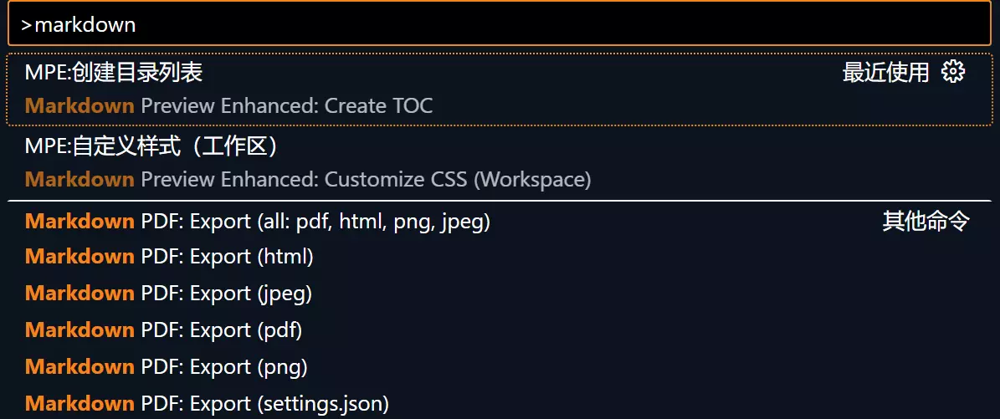
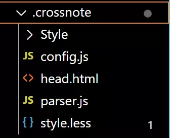
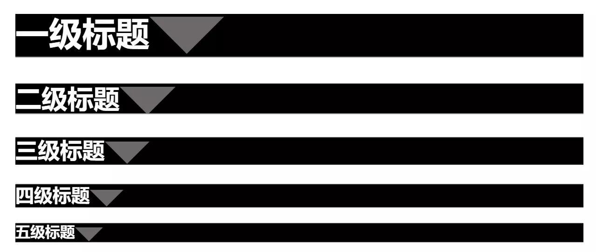
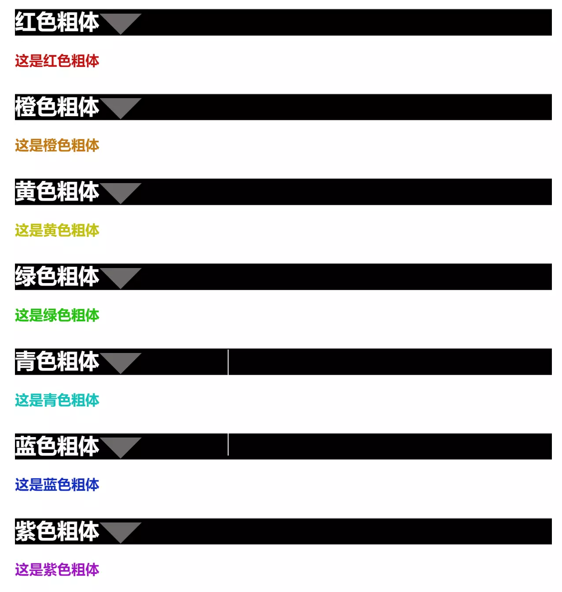
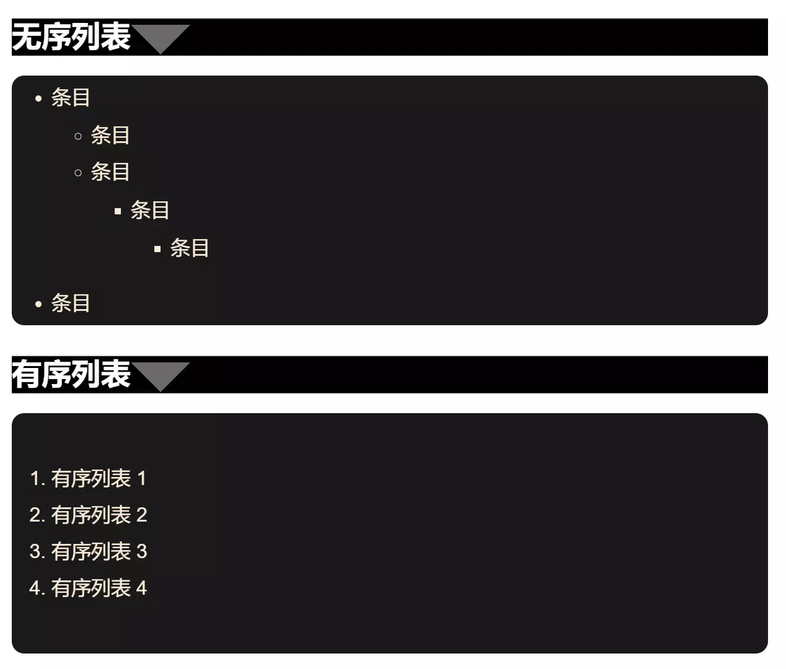
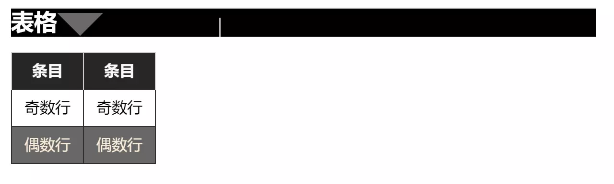
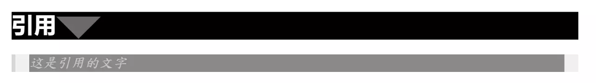

## 前言
Vscode中有许多非常好用的插件，能够提升程序员的写作效率。其中Markdown prview enhanced作为一款markdown写作的预览插件，还是非常的有必要的。该软件可以实现自定义markdown的样式，今天分享一下配置技巧。

[Markdown基础语法](https://blog.cflmy.cn/2025/03/19/Technology/Markdwon/Markdown/)

## 下载安装
Vscode搜索Markdown Preview Enhanced，安装下载即可。

## 使用
自定义样式的使用需要打开命令窗口，按`ctrl+shift+p`后键入markdown找到自定义样式部分：

点击该命令后，系统会自动在工作区创建一个名为`.crossnote`的文件夹。

> 注：其中的Style文件夹是笔者自己创建的，并非自己产生的，需要注意。

## 配置说明
在该目录下的style.less文件中修改就可以更改markdown文件的预览和导出样式，但是需要注意的是，这样做会使得全局样式的更改变得比较困难，因此笔者更加推荐创建`.less`文件并使用`@import "path to your .less file"`或者是`<!-- @import "path to your .less file" -->`
笔者个人更加推荐第二种写法，因为本质上是一种注释，会在其他编译器下被忽视，所写的markdown文件的泛用性更加的强大。

此外在parser.js处增加一些内容也可以使得markdown预览获得增强效果，详细的配置方法见下列笔者配置。

## 笔者配置

### parser.js
```js
({
  // Please visit the URL below for more information:
  // https://shd101wyy.github.io/markdown-preview-enhanced/#/extend-parser
  onWillParseMarkdown: async function(markdown) {
    //return markdown;
    // 修改标题,确保字体颜色一定是自己修改的样式
    
    markdown = markdown.replace(/(#+)\s+(.*)/gm, (match, hashes, text) => {
      // 确定标题的等级
      const level = hashes.length;
      return `<h${level}><span class="hh">${text.trim()}</span></h${level}> \n`;
    });
    
    //添加对于!text!的支持使得text内的内容变为红色粗体
    markdown = markdown.replace(/!(.+?)!/g, (_, content) =>`<span class="bred">${content}</span>`);
    //添加对于@text@的支持使得text内的内容变为橙色粗体
    markdown = markdown.replace(/@(.+?)@/g, (_, content) =>`<span class="borange">${content}</span>`);
    //添加对于#text#的支持使得text内的内容变为黄色粗体
    markdown = markdown.replace(/；(.+?)；/g, (_, content) =>`<span class="byellow">${content}</span>`);
    //添加对于￥text￥的支持使得text内的内容变为绿色粗体
    markdown = markdown.replace(/￥(.+?)￥/g, (_, content) =>`<span class="bgreen">${content}</span>`);
    //添加对于%text%的支持使得text内的内容变为青色粗体
    markdown = markdown.replace(/%(.+?)%/g, (_, content) =>`<span class="bcyan">${content}</span>`);
    //添加对于?text?的支持使得text内的内容变为蓝色粗体
    markdown = markdown.replace(/\?(.+?)\?/g, (_, content) =>`<span class="bblue">${content}</span>`);
    //添加对于&text&的支持使得text内的内容变为紫色粗体
    markdown = markdown.replace(/&(.+?)&/g, (_, content) =>`<span class="bpurple">${content}</span>`);
    return markdown;
  },

  onDidParseMarkdown: async function(html) {
    return html;
  },

})
```
以上的修改增加了一些对于markdown的一些样式的支持，在不添加这些语法进入的时候，并不会出现改变。实现的效果见下文。

### 标题
```css
.hh{
  color: #fffcfc;
}

/* 一级标题 */
h1 {
    margin: 10px auto;
    height: 35px;
    background-color: rgb(0, 0, 0);
    border-bottom: 1px solid rgb(25, 24, 24);
    //overflow: hidden;
    //box-sizing: border-box;
    color: #f0f0f0;
  }
  
  /* 二级标题内容 */
  h1 .content {
    margin-top: -1px;
    margin-left: -10px;
    //display: inline-block;
    width: auto;
    height: 40px;
    background-color: rgb(0, 0, 0);
    border-bottom-right-radius:100px;
    padding-right: 30px;
    padding-left: 30px;
  }
  
  h1:after {
    display: inline-block;
    content: " ";
    vertical-align: bottom;
    border-top: 40px solid #6d6968;
    border-right: 40px solid transparent;
    border-left: 40px solid transparent;
  }
    
  /* 二级标题 */
  h2 {
    margin: 10px auto;
    height: 33px;
    background-color: rgb(0, 0, 0);
    border-bottom: 1px solid rgb(25, 24, 24);
    overflow: hidden;
    box-sizing: border-box;
    color: #f0f0f0;
  }
    
  /* 二级标题内容 */
  h2 .content {
    margin-left: -10px;
    display: inline-block;
    width: auto;
    height: 40px;
    background-color: rgb(0, 0, 0);
    border-bottom-right-radius:100px;
    padding-right: 30px;
    padding-left: 30px;
    line-height: 40px;
    font-size: 16px;
  }
  
  h2:after {
    display: inline-block;
    content: " ";
    vertical-align: bottom;
    border-top: 30px solid #6d6968;
    border-right: 30px solid transparent;
    border-left: 30px solid transparent;
  }
  
  /* 三级标题 */
  h3 {
    margin: 20px auto 5px;
    border-top: 1px solid rgb(221, 221, 221);
    box-sizing: border-box;
    color: #f0f0f0;
    background-color: rgb(0, 0, 0);
    border-bottom: 1px solid rgb(25, 24, 24);
  }
  
  /* 三级标题内容 */
  h3 .content {
    margin-top: -1px;
    padding-top: 6px;
    padding-right: 5px;
    padding-left: 5px;
    font-size: 17px;
    border-top: 2px solid rgb(33, 33, 34);
    display: inline-block;
    line-height: 1.1;
  }
  
  h3:after {
    display: inline-block;
    content: " ";
    vertical-align: bottom;
    border-top: 24px solid #6d6968;
    border-right: 24px solid transparent;
    border-left: 24px solid transparent;
  }
  
  
  h4 {
    margin: 10px auto -1px;
    border-top: 1px solid rgb(221, 221, 221);
    box-sizing: border-box;
    color: #f0f0f0;
    background-color: rgb(0, 0, 0);
    border-bottom: 1px solid rgb(25, 24, 24);
  }
  
  h4 .content {
    margin-top: -1px;
    padding-top: 6px;
    padding-right: 5px;
    padding-left: 5px;
    font-size: 16px;
    border-top: 2px solid rgb(33, 33, 34);
    display: inline-block;
    line-height: 1.1;
  }
  
  h4:after {
    display: inline-block;
    content: " ";
    vertical-align: bottom;
    border-top: 18px solid #6d6968;
    border-right: 18px solid transparent;
    border-left: 18px solid transparent;
  }
  
  h5 {
    margin: 10px auto -1px;
    border-top: 1px solid rgb(221, 221, 221);
    box-sizing: border-box;
    color: #f0f0f0;
    background-color: rgb(0, 0, 0);
    border-bottom: 1px solid rgb(25, 24, 24);
  }
  
  h5 .content {
    margin-top: -1px;
    padding-top: 6px;
    padding-right: 5px;
    padding-left: 5px;
    font-size: 16px;
    border-top: 2px solid rgb(33, 33, 34);
    display: inline-block;
    line-height: 1.1;
  }
  
  h5:after {
    display: inline-block;
    content: " ";
    vertical-align: bottom;
    border-top: 15px solid #6d6968;
    border-right: 15px solid transparent;
    border-left: 15px solid transparent;
  }
```
标题配置之后的效果如下：

这一部分的源码是：
```markdown
# 一级标题
## 二级标题
### 三级标题
#### 四级标题
##### 五级标题
```
也就是将标题控制为黑底白字。

### 自定义彩色粗体
这里使用了一些新的markdown语法,也就是我们在parser.js新增的部分的支持，需要配合使用，否则不会生效。配置内容如下：
```css
/*自定义样式，红色粗体blue*/
.bred {
    color: #c21515;
    font-weight: bold;
}

/*自定义样式，橙色粗体blue*/
.borange {
    color: #c27a15;
    font-weight: bold;
}

/*自定义样式，黄色粗体blue*/
.byellow {
    color: #c2bf15;
    font-weight: bold;
}

/*自定义样式，黄色粗体blue*/
.bgreen {
    color: #29c215;
    font-weight: bold;
}
  
/*自定义样式，青色粗体blue*/
.bcyan {
    color: #15c2b9;
    font-weight: bold;
}

/*自定义样式，蓝色粗体blue*/
.bblue {
    color: #152fc2;
    font-weight: bold;
}

/*自定义样式，青色粗体blue*/
.bpurple {
    color: #9d15c2;
    font-weight: bold;
}
```
配置的效果如下所示：

对应的源码如下所示：
```markdown
### 红色粗体
!这是红色粗体!
### 橙色粗体
@这是橙色粗体@
### 黄色粗体
=这是黄色粗体=
### 绿色粗体
￥这是绿色粗体￥
### 青色粗体
%这是青色粗体%
### 蓝色粗体
?这是蓝色粗体?
### 紫色粗体
&这是紫色粗体&
```

### 列表
```css
/*无序列表*/
li section {
    font-size: 15px;
    font-family: "Helvetica Neue", Helvetica, "Segoe UI", Arial, freesans, sans-serif;
  }
  
  /* 无序列表整体样式
   * list-style-type: square|circle|disc;
   */
ul {
    list-style-type: square;
    color:antiquewhite;
    border-radius: 10px; /* 设置边框圆角 */
    background-color: #1a1a1a; /* 设置背景颜色 */
    padding: 20px; /* 设置内边距 */
    padding-bottom: 5px;
    padding-top: 5px;
    text-indent: 0em;
  }
  
  /* 有序列表整体样式
   * list-style-type: upper-roman|lower-greek|lower-alpha;
   */
ol {
    list-style-type: upper-roman;
    color:antiquewhite;
    border-radius: 10px; /* 设置边框圆角 */
    background-color: #1a1a1a; /* 设置背景颜色 */
    padding: 40px; /* 设置内边距 */
    text-indent: 0em;
}
```
配置的效果如下所示：

对应的源码如下所示：
```markdown
### 无序列表
* 条目
    - 条目
    - 条目
        - 条目
            - 条目
* 条目
### 有序列表
1. 有序列表 1
2. 有序列表 2
3. 有序列表 3
4. 有序列表 4
```

### 表格
```css
table{
  color: rgb(0, 0, 0);
  margin: 0 auto;  
  border-collapse: collapse;  /* 适当地合并单元格边框（可选） */
  display: table;  /* 保持为表格类型 */
}

  table tr th {
    border: 1px solid #cecece;
    background-color: #262626;
    color: #f8f8f8;
    border-bottom: 0;
  }
  
  table tr td {
    border: 1px solid #2d2d2d;
  }
  
  body table tr th {
    border: 1px solid #cecece;
    background-color: #262626;
    color: #f8f8f8;
    border-bottom: 0;
  }
  
  body table tr td {
    border: 1px solid #2d2d2d;
  }
  
  body table tr:nth-child(2n) {
    background-color: #686868;
    color: antiquewhite;
    border: 1px solid #a1a1a1;
  }
```
实现的效果：

对应的源码：
```markdown
### 表格
|条目|条目|
|-|-|
|奇数行|奇数行|
|偶数行|偶数行|
```
### 引用
```css
body blockquote {
    border-left-color: rgb(0, 0, 0);
    margin-top: 1.2em;
    margin-bottom: 1.2em;
    padding-right: 1em;
    padding-left: 1em;
    border-left-width: 4px;
    background-color: rgb(79, 79, 79);
    quotes: none;
  }
  
  /* 引用文字 */
blockquote p {
    font-size: 15px;
    font-family:"DFKai-SB",-apple-system-font, BlinkMacSystemFont, "Helvetica Neue", "PingFang SC", "Hiragino Sans GB", "Microsoft YaHei UI", "Microsoft YaHei", Arial, sans-serif;
    font-style: italic;
    color: rgb(200, 200, 200);
    background-color: rgb(137, 137, 137);
    line-height: 1.25em;
}
```
实现的效果：

对应的源码：
```markdown
### 引用
> 这是引用的文字
```

## 后记
总结而言，配置该插件实现自定义的markdown样式还是很酷的，由于为了保证不同情况下的markdown尽可能通用，作者采用了以上配置方式，读者可以自行尝试可行的配置方式及样式。
