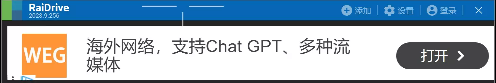
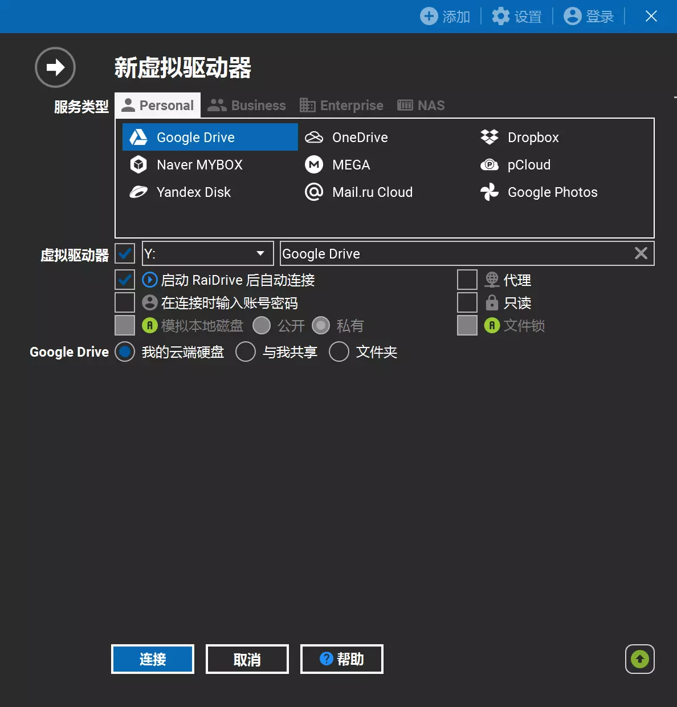
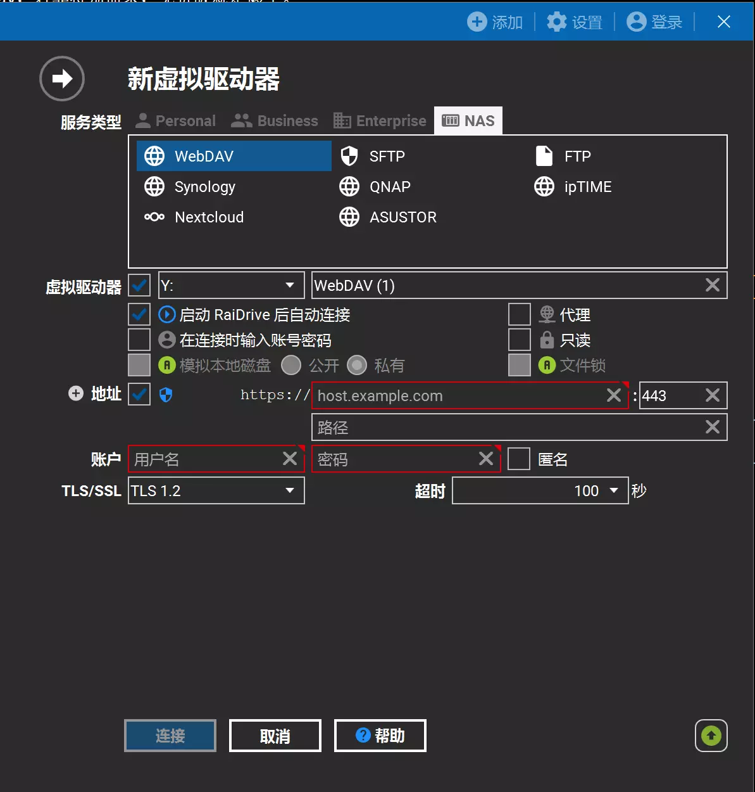

## 前言
之前我们介绍了Alist，Alist支持WebDav协议，而RaiDrive恰好可以通过WebDav协议将云盘作为U盘挂载在本地。因此这里介绍一下RaiDrive。

[RaiDrive官方网址](https://www.raidrive.com/)

## 下载
打开官网，点击下载，安装系统适合的版本即可，这里不再赘述。


需要注意的是RaiDrive分为免费版和付费版，免费版可以使用WebDav，若非特别需求，免费版就足够了。


## 配置
打开安装的RaiDrive，会出现如下的界面：

忽略免费版的广告，点击添加字样，会出现界面：

此时按照需求进行配置即可。

### WebDav的配置
在上述界面中找到服务类型，点选NAS，第一个就是WebDav，界面如下所示：

这里配置的时候，需要注意地址之后的勾选框要取消勾选，接下来将其他内容一一配置即可。

如果是使用Alist进行配置的，则地址是Alist的服务地址，端口是我们修改后的端口，用户名和密码是我们在Alist中设置好的。

需要特别注意的是，在路径部分一定要填写/dav，否则的话，会提示405错误。

## 后记
在完成上述配置之后，RaiDrive就会把我们配置好的云盘挂载在本地，我们就可以像使用本地文件一样使用云盘了。只不过，毕竟是云盘，因此，访问文件的速度还是非常依赖网速的。
