## 前言

> 事物的发展总是螺旋式上升和波浪式前进。

作者在之前曾介绍过两种云盘挂载工具，但是各有缺点，正在作者苦恼的时候，突然发现其实完全不需要借助挂载工具，仅靠Windows下自带的工具就可以完美实现这一任务。

不得不承认，人的认知也是螺旋式上升的，在这个时候，作者个人认为，直接使用Windows自带功能实现云盘挂载在本地是最快捷的。

## 配置
打开文件资源管理器，找到如下位置：

右键单击图中的网络，并选择`映射网络驱动器`会出现：
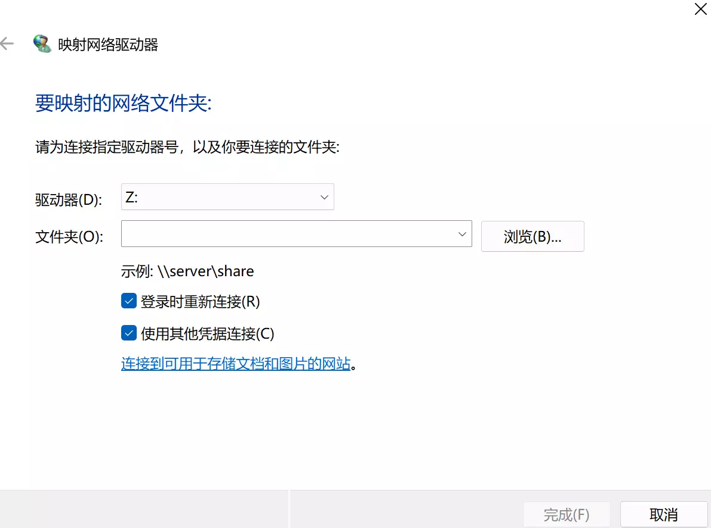
这时只需要输入配置的Alist服务地址，并在接下来输入自己的账号和密码就可以成功的进行连接了。

## 问题
如果你的配置顺利，在上一步就可以结束了，但是大部分人，或者说像作者一样的，会遇到如下问题：
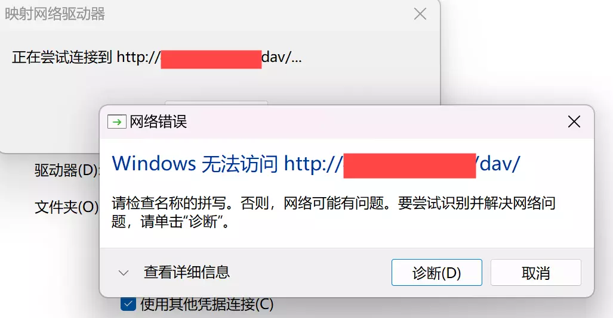

其实这里出现问题的原因是，Windows 默认的 WebClient 服务仅支持 https 协议 ，而我们自行配置的Alist大多是http协议的，因此需要将对http的支持打开。

则需要进行下列操作：
* 打开注册表编辑器：点击`win+R`,并在弹出界面输入`regedit`，进入注册表编辑器

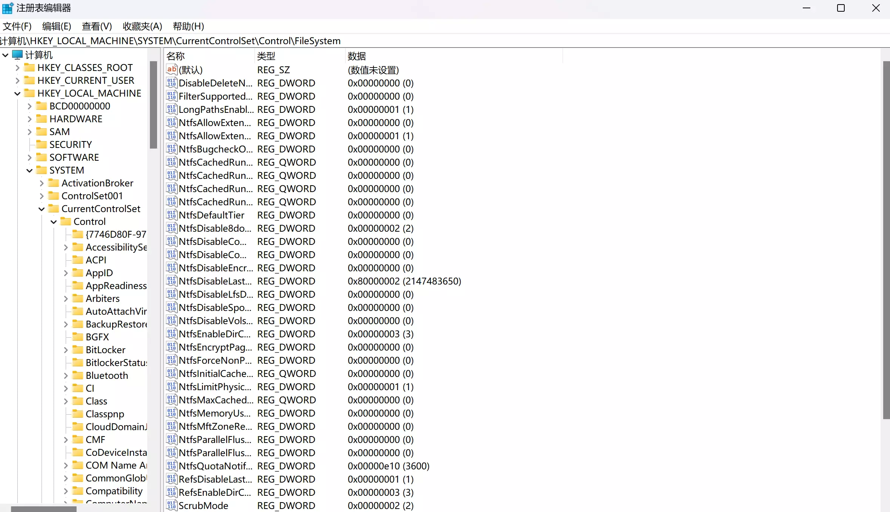
* 找到`BasicAuthLevel`：在如下位置输入`\HKEY_LOCAL_MACHINE\SYSTEM\CurrentControlSet\Services\WebClient\Parameters​`之后，将会自动定位到`BasicAuthLevel`.

* 修改`BasicAuthLevel`：`BasicAuthLevel`的默认值是1，需要修改为2，支持htpp协议。
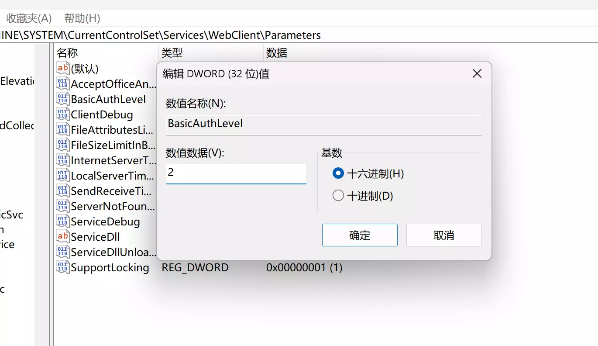
* 打开服务界面：点击`win+R`,并在弹出界面输入`services.msc`，进入服务界面
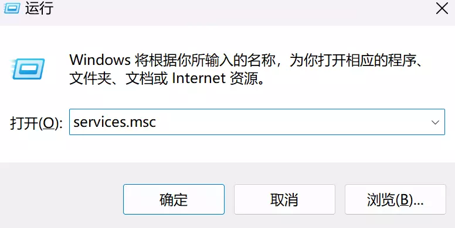
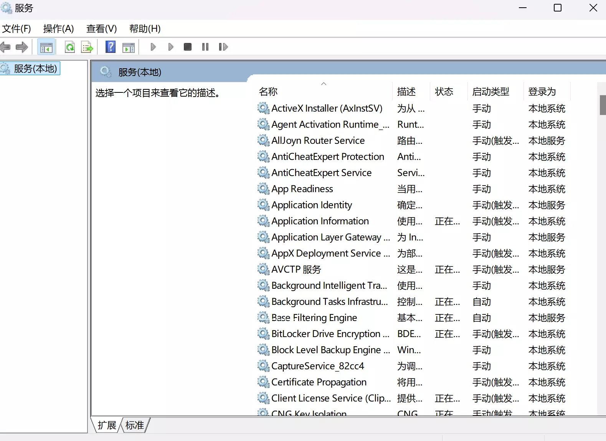
* 重启WebClient：在服务界面找到WebClient,重启即可：
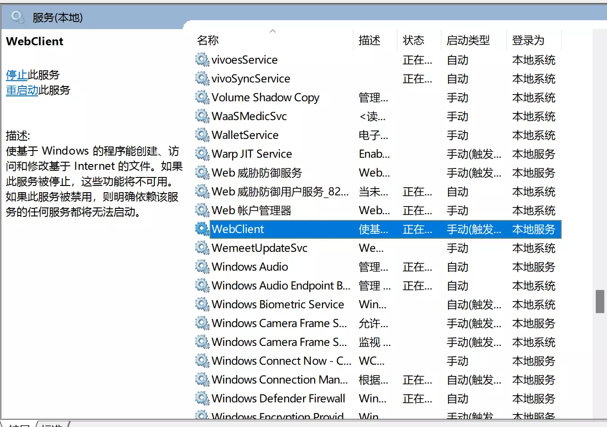

> 注：这里建议设置自动开启WebClient服务，否则的话，每次打开电脑都需要重新开启该服务，会相对比较麻烦。
具体方法为，右键点击WebClient,选择属性，打开如下窗口：
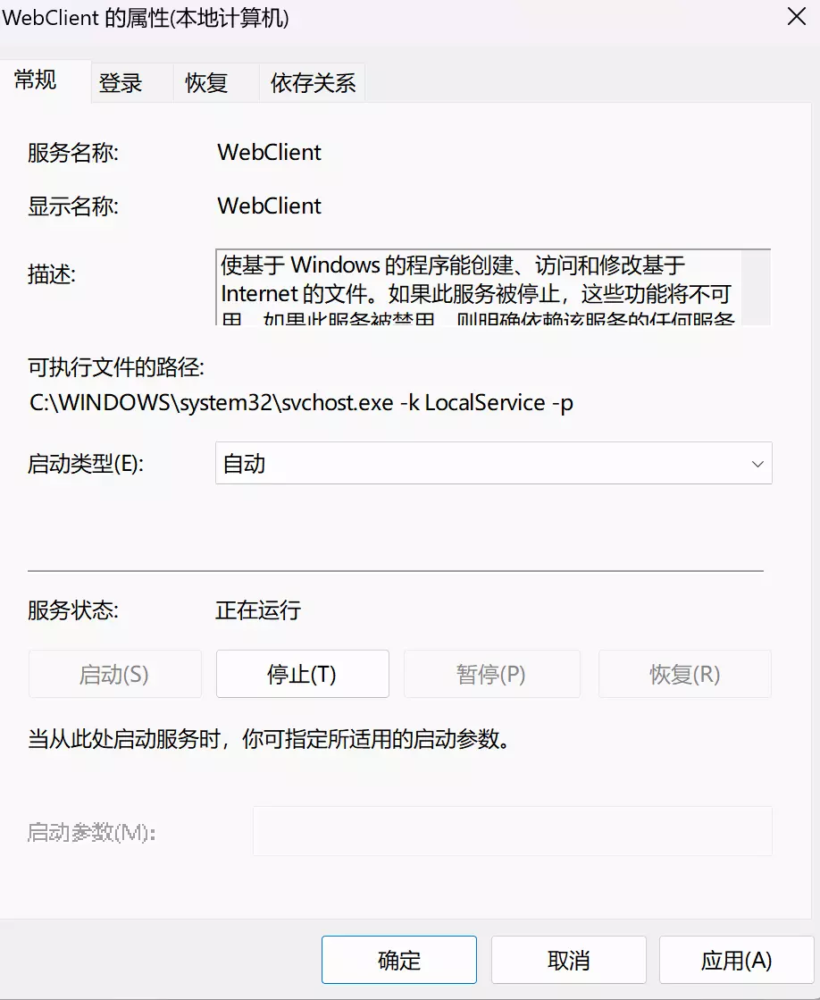
在启动类型中像作者一样设置为自动即可。

在完成上述操作之后，重新进行配置部分

## 其他配置
除了上述配置方式还可以采取其他方式将云盘作为文件夹添加到本地（如果是http也要配置WebClient）

打开文件资源管理器，点击`此电脑`会出现：

右键单击空白处，并选择`添加一个网络位置`会出现：
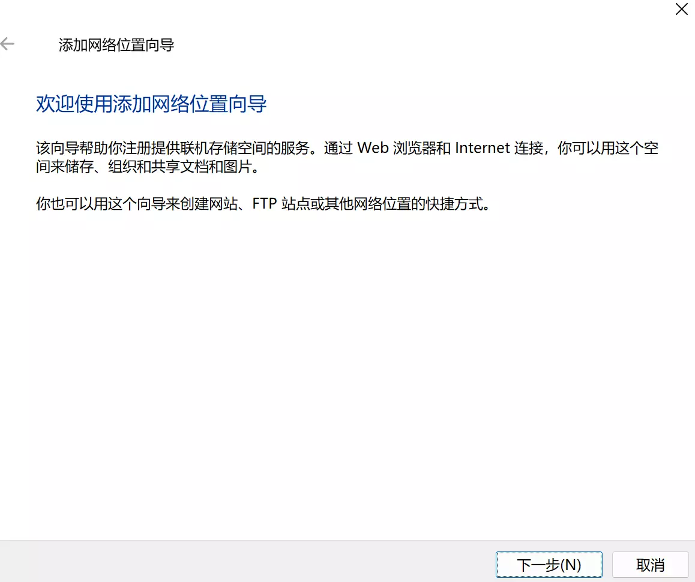
不断点击下一步，会依次出现：

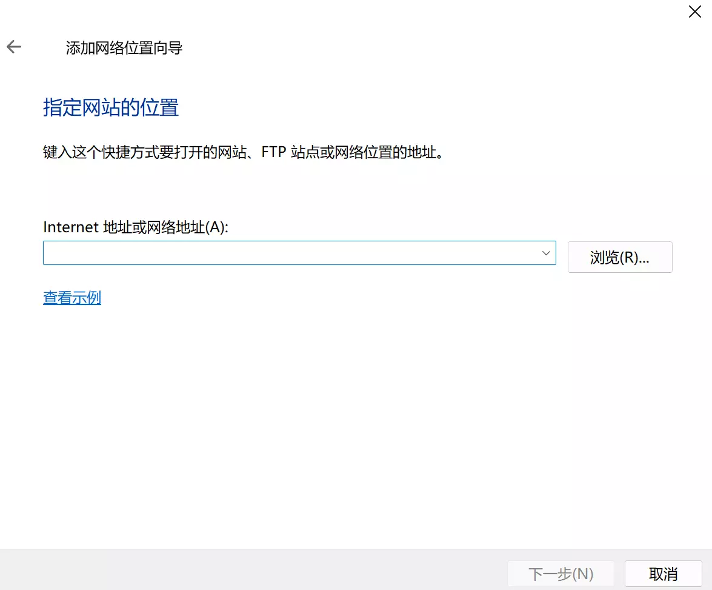
输入我们配置的地址，再点击下一步，会出现：
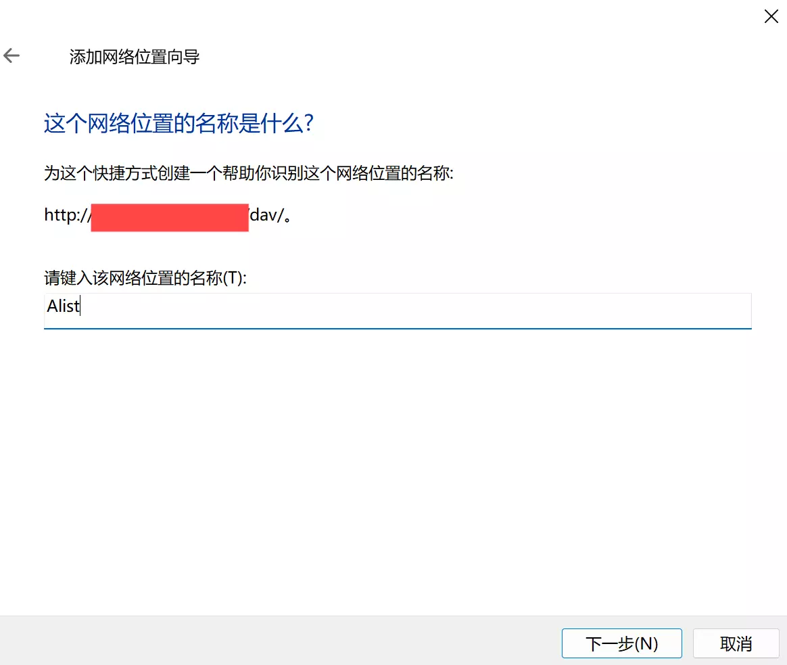
这里的名称自行指定即可。

最终配置完成的结果为：

## 禁用自动搜索网络文件夹和打印机(2025-03-31增补)
在作者使用Windows自带功能挂载云盘在本地的时候，发现文件资源管理器加载速度变慢，且有时候会出现卡死的情况，在查阅资料之后，发现原来是由于Windows会自动搜索网络文件夹和打印机，这就使得我们挂载的云盘会被自动扫描，使得文件资源管理器的速度变慢，在这种情况下，可以采取如下配置关闭该功能。


这里需要注意的是，关闭该功能之后，以后网络上的文件夹和打印机就不会被自动搜索到了，需要手动的添加，因此是否按照此方法进行配置，取决于个人需求。


* 首先打开打开注册表编辑器：点击`win+R`,并在弹出界面输入`regedit`，进入注册表编辑器

* 输入`计算机\HKEY_LOCAL_MACHINE\SOFTWARE\Policies\Microsoft\Windows`定位到该位置，查看是否存在`Explorer`项，如果不存在，则新建`Explorer`项
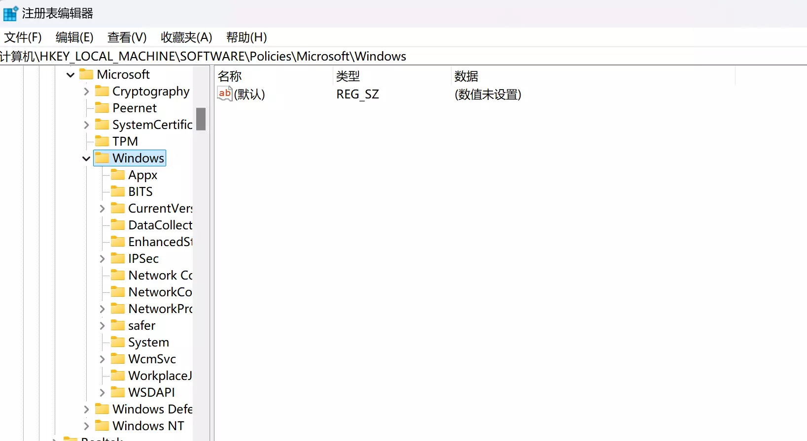
* 右键点击 Explorer 后新建 DWORD (32位) 值 并命名为 NoAutoplayForDevices，之后将该值设置为1即可。
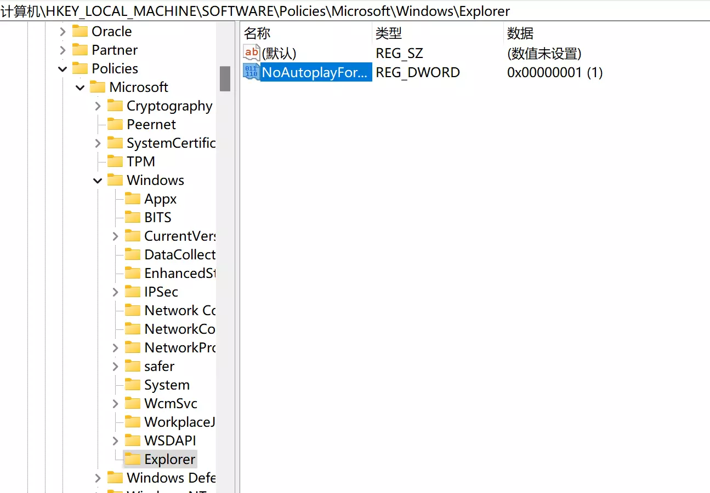
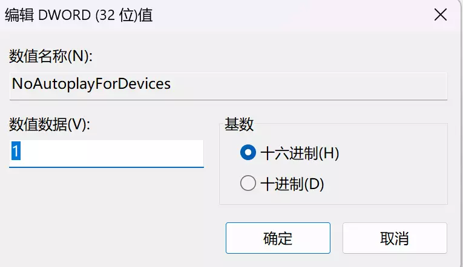
* 保存之后重启电脑，配置即可自动生效。

## 后记
有了这么多配置方式，基本上云盘挂载本地已经不是什么难事了，大家可以自行选择合适自己的配置方式。

