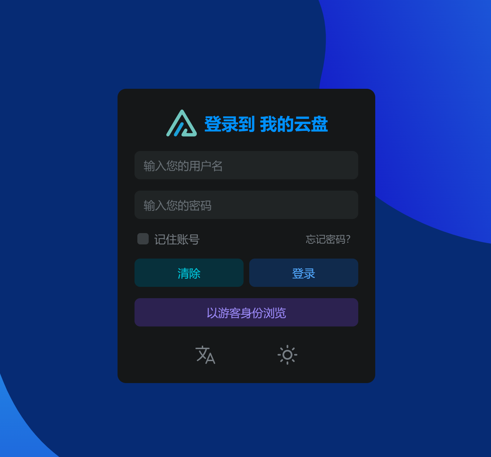
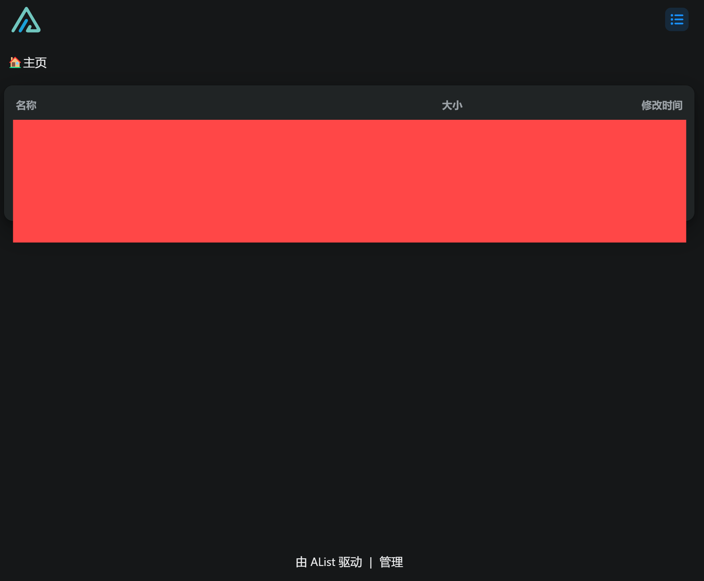
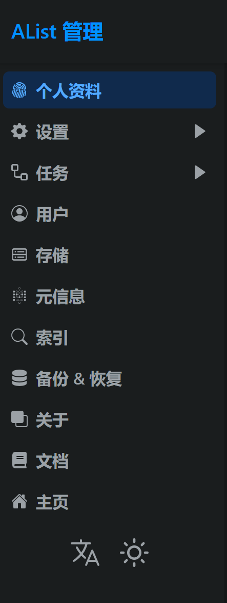
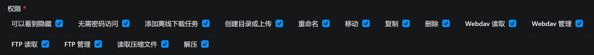

## 前言
Alist是一个能够实现云盘统一管理的的工具，同时支持WebDav的特性，使得通过Alist配置的云盘工具能够方便的作为U盘挂载在本地。

[Alist中文官方地址](https://alist.nn.ci/zh/)

## 下载
### Linux下载
在命令行输入如下命令：
```ps
curl -fsSL "https://alist.nn.ci/v3.sh" -o v3.sh && bash v3.sh
```
会自动启动安装脚本，此外还可以指定安装的路径：
```ps
# Install
curl -fsSL "https://alist.nn.ci/v3.sh" -o v3.sh && bash v3.sh install /path_to_alist
# update
curl -fsSL "https://alist.nn.ci/v3.sh" -o v3.sh && bash v3.sh update /path_to_alist
# Uninstall
curl -fsSL "https://alist.nn.ci/v3.sh" -o v3.sh && bash v3.sh uninstall /path_to_alist
```
个人建议使用指定路径的安装方式。


在安装过程中需要使用Github安装下载，自动安装脚本会自动提示是否使用Github代理。

但是在使用过程中，作者输入的代理网址都失效了，因此没有在这里贴出，直接使用Github原网站也是可以直接下载的，虽然速度会慢一些。


### Windows和Mac下载
直接在官方寻找合适的版本下载即可，这里不再赘述。

如果有问题，可以查阅官方文档。

## 开启
### 设置用户
在Alist启动之前，建议先设置以下admin用户的密码，在官方文档中也有注明，在低于v3.25.0版本的时候，需要使用：
```ps
./alist admin
```
而在高于该版本的时候，则需要采用：
```ps
# 随机生成一个密码
./alist admin random
# 手动设置一个密码,`NEW_PASSWORD`是指你需要设置的密码
./alist admin set NEW_PASSWORD
```

### 开始服务
在命令行输入：
```ps
./alist server
```
此时会自动开启Alist的服务，在本机的5244(默认)运行。

这时候，只需要打开`0.0.0.0:5244`或`127.0.0.1:5244`或者`本地IP地址:5244`打开使用即可。


这里需要注意的是，5244这个端口可能已经被占用，或者如果你不想使用该端口，就需要修改开启的端口。

修改端口需要打开与alist同级目录的data文件夹，找到config.json文件，打开找到5244，修改为想要更改的端口即可。


### 保持Alist的运行
`./alist server`命令会在退出命令行之后自动退出Alist服务，因此如果需要一直保持Alist服务的开启的话，需要使用下列命令：
```ps
./alist start
```
这样Alist就会一直运行在我们配置好的端口了。

## 使用
在浏览器中打开`本地IP地址:配置端口`将会自动进入Alist登录界面：

输入我们设置好的用户名和密码，进入主页，会出现：


> 注：红色遮盖部分是作者已经配置好的云盘，正常第一次登陆的时候是没有的。

接着我们需要点击下方的管理，进入管理界面：

在这里可以进行许多内容的更改，如修改密码增加二重身份验证等。

需要特别进行的修改在用户部分点击用户，打开如下界面：


正常的Alist是不会自动开启WebDav服务的，我们需要手动开启权限，点击编辑，进入界面：

只需要将我们需要的用户的WebDav权限开启即可。

## 后记
作者也是刚刚接触Alist的，这个云盘管理工具确实非常的实用，而如何添加云盘到Alist中，官方文档中写的十分清楚，就不再赘述了。

[Alist添加存储官方文档](https://alist.nn.ci/zh/guide/drivers/common.html)

---
### 同系列
[Alist云盘管理工具的配置](https://blog.cflmy.cn/2025/03/20/Technology/Cloud/Alist-install/)
[RaiDrive云盘挂载本地工具的使用](https://blog.cflmy.cn/2025/03/20/Technology/Cloud/RaiDrive/)
[NetMount云盘挂载本地工具的使用](https://blog.cflmy.cn/2025/03/25/Technology/Cloud/NetMount/)
[Windows自带功能实现云盘挂载本地](https://blog.cflmy.cn/2025/03/26/Technology/Cloud/Windows/)
[Alist配置域名和SSL](https://blog.cflmy.cn/2025/04/16/Technology/Cloud/Alist-specs/)