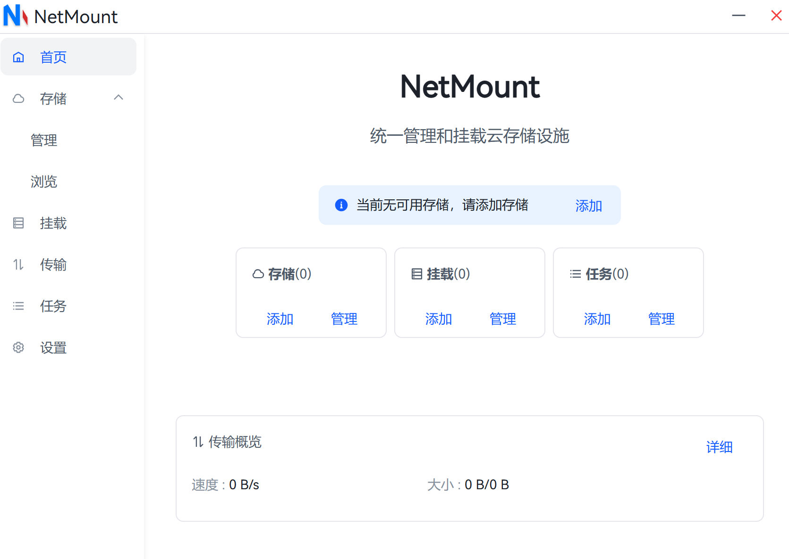
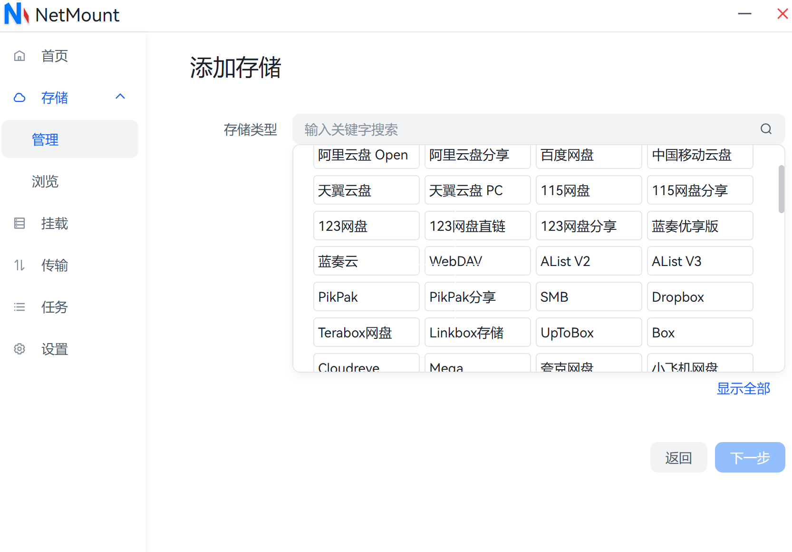
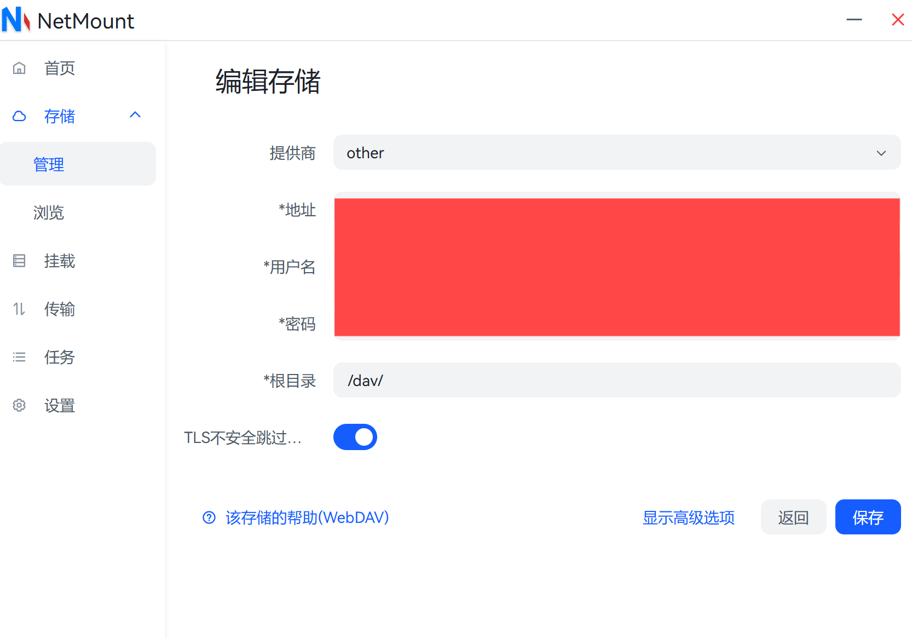
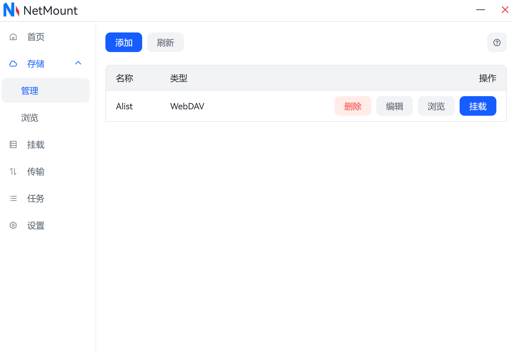
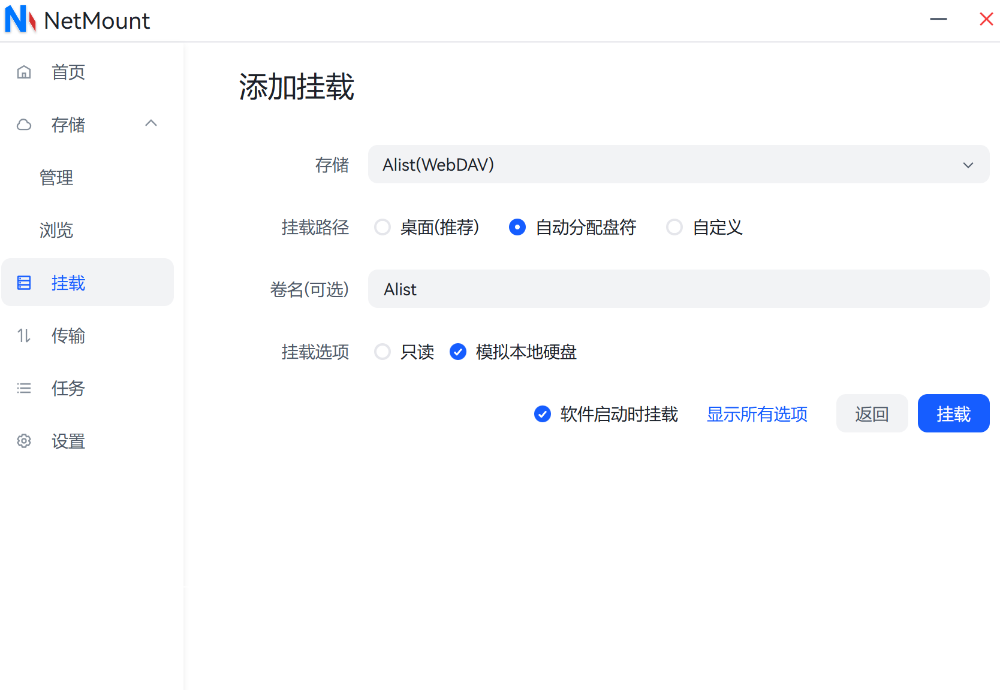

## 前言
之前介绍了RaiDrive的配置方式，但是作者使用了一段时间之后，不得不表示，RaiDrive的广告还是非常影响使用体验的，除此之外，RaiDrive的外观界面也很丑，所以，作者重新选择了挂载工具，也就是今天介绍的NetMount。

## 下载
[NetMount下载页](https://www.netmount.cn/download)

点击以上链接，选择下载的版本下载即可。

## 配置
下载安装之后，打开NetMount软件会出现：

这时，只需要点击添加存储,将会跳转到：

仍然选择WebDav,并点击下一步，会跳转到：

接下来只需要按照和RaiDrive差不多的配置就可以配置完成了。


需要注意的是，如果使用Alist进行配置，根目录后面一定要跟着一个`/`符号，这样才能确保配置成功。


## 挂载
在配置完成之后，会出现：

此时，只需要点击挂载，会跳转到：

只需要按照我们想要使用的方式，选择配置即可完成挂载。


点击挂载后，第一次初始化时间会花费的比较久，耐心等待即可。


## 后记
NetMount目前正处于开发阶段，作者在使用的过程中经常会遇到一些奇怪的问题，因此建议追求稳定使用的读者使用RaiDrive。后续如果找到更好的替代项，作者会第一时间更新的。

---
### 同系列
[Alist云盘管理工具的配置](https://blog.cflmy.cn/2025/03/20/Technology/Cloud/Alist-install/)
[RaiDrive云盘挂载本地工具的使用](https://blog.cflmy.cn/2025/03/20/Technology/Cloud/RaiDrive/)
[NetMount云盘挂载本地工具的使用](https://blog.cflmy.cn/2025/03/25/Technology/Cloud/NetMount/)
[Windows自带功能实现云盘挂载本地](https://blog.cflmy.cn/2025/03/26/Technology/Cloud/Windows/)
[Alist配置域名和SSL](https://blog.cflmy.cn/2025/04/16/Technology/Cloud/Alist-specs/)