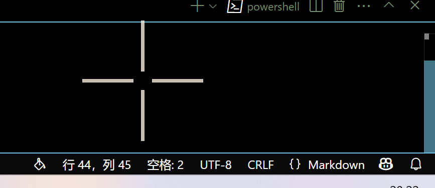
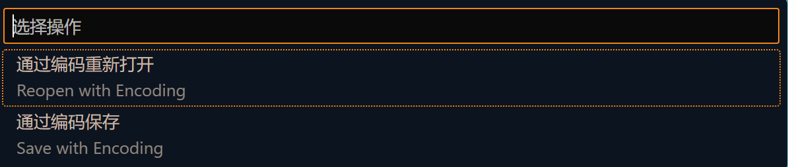
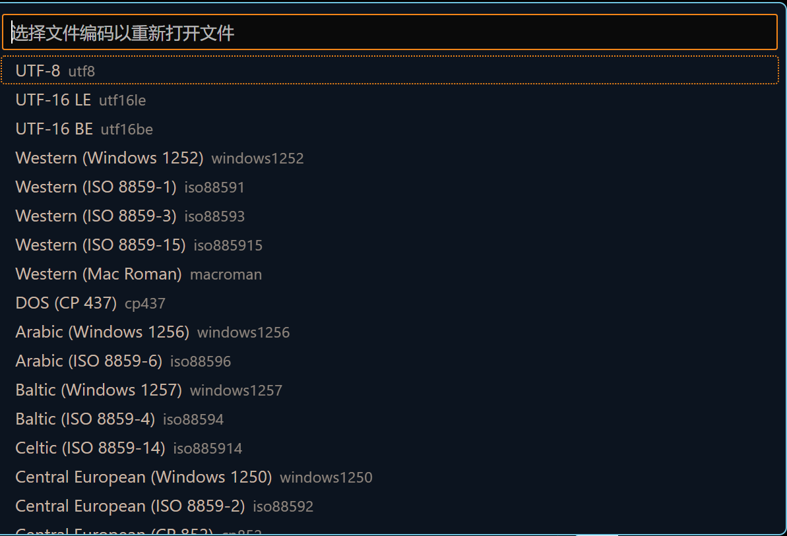

## 前言
注释应当是英文的，输出也应当是英文的，但是实际上作者在很多时候为了方便，就会直接进行中文的注释和输出的操作，自然也会有乱码问题的出现。
在一段时间之前，作者的朋友也出现了乱码问题，显然作者是没有成功解决，这是由于作者本人之前的一贯操作是，编码出现问题那就改成UTF-8，改完就没有问题了，但是实际上，这是作者对于编码的某种不熟悉造成的，这样的操作显然不能正确的解决乱码问题。在查阅了一些资料之后，作者对于乱码问题有了更加深入的了解，因此这里写一个简短的记录。

## 产生原因
比较通俗的理解一下乱码问题，计算机存储数据依靠一大串的`01010101`，换句话说，不管是什么程序、数据、图像、音乐等所有的一切，离远了看都是好多多的`01`。

在这样的前提下，计算机就需要通过不同的方式展示出不同的`01`表示的含义，在这种情况下，就需要进行编码和解码。

那么乱码产生的原因就非常清楚了，就是编码格式和解码格式的不一致。

## 解决方式
知道了问题的产生原因之后，解决方式就比较简单了，只要想办法统一编码和解码一致就可以了，因此在相当长的一段时间里，作者执行的操作都是改成`UTF-8`编码。

这个操作在某些时候十分的有效，但是总会遇到一些情况我们只能修改编码段或者只能修改解码端，在这种情况下，还是需要一些知识来判断究竟是出现了怎么样的编码和解码问题。

### 情况判断

一般情况下，可以通过乱码的样式来进行编码和解码格式的判断，在中文系统下，比较常用的有`GBK`和`UTF-8`格式的编码，当不一致的时候，会出现下列情况：

|编码|解码|产生乱码|原码示例|乱码示例|
|-|-|-|-|-|
|`UTF-8`|`GBK`|形如古文的乱码，可能会夹杂形如日文韩文类的字符|你好 世界！|浣犲ソ 涓栫晫锛|
|`GBK`|`UTF-8`|形如黑色小方块的乱码|你好 世界！|��� ���磡|

此外还有二次解码的情况，这时产生的乱码又变为：

|编码|一次解码|二次解码|产生乱码|原码示例|乱码示例|
|-|-|-|-|-|-|
|`GBK`|`UTF-8`|`GBK`|大部分是锟斤拷的乱码|你好 世界！|锟斤拷锟� 锟斤拷锟界！|
|`UTF-8`|`GBK`|`UTF-8`|在字符串长度为奇数时末尾会变为问号|你好 世界！|你好 世界�?|

### 常见的问题和常用解决方式
#### Vscode切换单个编码格式
Vscode下的保存方式一般为UTF-8格式，这种编码格式也比较兼容，需要的时候可以进行单个文件切换编码，要进行修改可以在右下角点击编码格式进行修改

点击当前的编码格式在顶部会出现

此时选择想要进行的操作，将会出现

选择想要的编码格式即可。


需要注意的是，切换编码之后，原有的中文字符都会变为乱码，因此要相对谨慎的操作，可以新建一个文件，切换为想要的编码之后把代码复制进去。


#### C语言下显式指定
Windows下终端输出大多是`GBK`编码，而最容易出现乱码问题的莫过于C语言和C++类语言，在这种情况下可以显式的指定终端以`UTF-8`方式输出，例如：
```c
// Note 该文件保存编码为`UTF-8`,如果切换编码格式，原有的中文会全部变为乱码，在这种情况下，不妨显式的指定`UTF-8`格式输出
#include <stdio.h>
int main()
{
    SetConsoleOutputCP(65001); //显式指定终端解码格式为UTF-8
    printf("你好 世界!");
    return 0;
}
```

## 后记
编解码的格式显然远远不止本文提到的内容，不过暂时知道这些就足够了，后续会进行补充的。

