## 前言
PlantUml作为一种脚本编码的语言，很多图像都可以绘制，思维导图也在其中。

## Hello World!
~~~
@startmindmap
* Hello
** World
** !
@endmindmap
~~~
展示的效果如下：

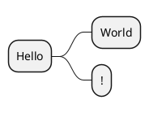

## 基本使用方式
### 基本创建方式
#### 标识开始
PlantUml使用以下方式标识思维导图：
~~~
@startmindmap
@endmindmap
~~~
#### 普通语句
~~~
@startmindmap
* Root1
** Branch1
*** SubBranch1
*** SubBranch2
**** SubSubBranch1
** Branch2

* Root2
@endmindmap
~~~
显示效果如下
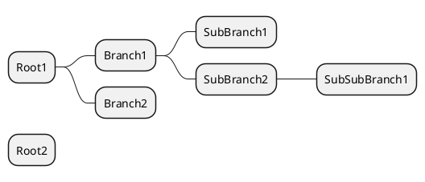
#### 左右方向的区分
使用'+','-'进行区分。
~~~
@startmindmap
* Root
++ LeftBranch1
+++ SubLeftBranch1
+++ SubLeftBranch2
++ LeftBranch1
-- RightBranch1
--- SubRightBranch1
--- SubRightBranch2
-- RightBranch2
@endmindmap
~~~
显示效果
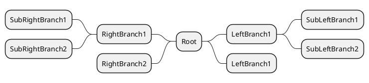
#### 竖直方向
PlantUml默认的思维导图是水平排布的，如果需要改变为竖直排布，需要显式的进行指定`top to bottom direction`
~~~
@startmindmap
top to bottom direction
* Root
++ DownBranch1
+++ SubDownBranch1
+++ SubDownBranch2
++ DownBranch1
-- UpBranch1
--- SubUpBranch1
--- SubUpBranch2
-- UpBranch2
@endmindmap
~~~
显示效果如下：
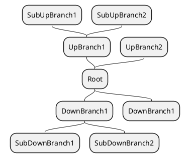
### Markdown式
除了上述类型的写作方式外，Plantuml还支持Markdown式的思维导图样式：
~~~
@startmindmap
* Root 
  * Branch1 
    * SubBranch1 
    * SubBranch2
  * Branch2
@endmindmap 
~~~
可以简单的理解为使用缩进代替了原来的多个'*'号。上述代码展示的效果如下所示：
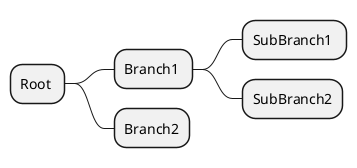

## 插入公式
既然愿意使用PlantUml来进行思维导图的绘制，一定是要因为某些好处，显然这个好处就是公式插入的方便。因此这里特意将这一部分提到了其他部分的最前面。
### Ascii Math使用
~~~
@startmindmap
* <math> \int_0^1 f(x)dx </math>
** <math> \frac{\partial f}{\partial x} </math>
@endmindmap
~~~
显示效果如下所示
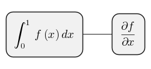
### JLaTeXMath使用
~~~
@startmindmap
* <latex> \int_0^1 f(x)dx </latex>
** <latex> \frac{\partial f}{\partial x} </latex>
@endmindmap
~~~
显示效果如下所示
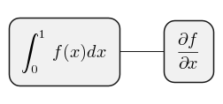


经过在Webserver的实际测试，在在线版中时，输出为png格式下显示是正常的，而输出为svg格式时渲染出的结果和本博客展示的效果是一致的，暂时没有找到合适的解决方式。后续找到合适的解决方式之后会第一时间更新此处的。


## 美化
### 移除方框
使用'_'下划线来移除方框：
~~~
@startmindmap 
*_ Root
**_ Branch1
**_ Branch2 
@endmindmap 
~~~
展示的效果如下所示：
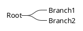
相较而言，我个人还是更加喜欢没有方框的样式，可能是因为看起来更加的简洁。
### 多行表示
使用思维导图的时候，有可能会出现文本过长的现象，此时多行表示就十分有用了。PlantUml使用':'和';'包围表示多行文本
~~~
@startmindmap
* Root
**:a
very
long text
aaaaaaaaaaaaaaaaaaaa
aaaaaaaaaaaaaaaaaa
;
@endmindmap
~~~
显示效果如下所示：
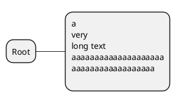
这里特别提醒，':'一定要紧邻着'*'号不然可能会报错。

### 改变颜色
#### 引用式
~~~
@startmindmap
* Root
**[#Orange] orange
**[#Blue] blue
**[#lightblue] lightblue
**[#FFBBCC] rose
@endmindmap
~~~
显示效果如下所示：
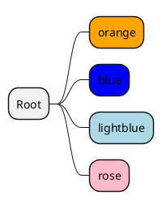
这里依然提醒一点，'[]'一定是紧邻着'*'的，不然依然会报错。

#### 定义式
~~~
@startmindmap

* Root
** green <<green>>
** rose <<rose>>
** lightblue <<your_style_name>>
@endmindmap
~~~
展示的效果如下：
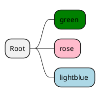
使用这种方式的好处在于可以更方便的使用自己喜欢的颜色，定制属于自己的思维导图主题。

## 后记
真正仔细了解了PlantUml思维导图的画法之后，我才意识到对于这个工具我掌握的还是很浅薄，后续可以期待继续开发以下更多有意思的用法。

---
### 同系列
[PlantUml-活动图基础](https://blog.cflmy.cn/2024/11/15/Technology/PlantUml/PlantUml-%E6%B4%BB%E5%8A%A8%E5%9B%BE-%E5%9F%BA%E7%A1%80/)
[PlantUml-思维导图基础](https://blog.cflmy.cn/2024/11/18/Technology/PlantUml/PlantUml-%E6%80%9D%E7%BB%B4%E5%AF%BC%E5%9B%BE%E5%9F%BA%E7%A1%80/)